# Fifteen ground units

Generated from `units.js` by `node grok4.7/build.js`. Edit `units.js` or `icons.js`, then rebuild. The readable overview with the stat table is [index.html](index.html).

Fifteen ground units for the 1989 rules. Each one is built around a decision the stock roster does not offer. They are proposals: the playable roster, the maps, and Mule’s whitelist stay as they are.
The numbers are ones the roster already uses. Range 1 shoots the adjacent hex and can counter. Range 2 or more shoots from hex 2 through that number, and the adjacent hex is a blind spot with no counter. Every unit projects a zone of control. Squads are 1–8. Pelican can carry all fifteen. Mule can carry none of them.

## Overview

Hex 1 is adjacent and can counter. Hex 2–N cannot touch the adjacent hex. A dash in a longer write-up means the chassis cannot enter; 0 means the movement points are not enough.

| | Unit | Move | Ground | Air | Def | Rules | What it is |
| --- | --- | --- | --- | --- | --- | --- | --- |
| 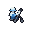 | **Ibex GX-41** — Mountain mortar | 3 Foot | 40 hex 2–3 | — | 10 | Move and fire | Foot mortar for mountains and valleys. It fires at hexes 2–3 on the turn it arrives. |
|  | **Harrier GX-52** — Mountain anti-air | 3 Foot | 10 hex 1 | 50 hex 1 | 10 | Move and fire | Foot anti-air for mountains and valleys. The shot is adjacent only, and it does not capture. |
| 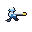 | **Pipit GX-44** — Standoff capturer | 3 Foot | 40 hex 2 | — | 10 | Move and fire, Captures | Captures. The missile hits only at hex 2, so a garrison beside the factory is outside the shot. |
|  | **Oryx CBX-3** — Road capturer | 6 Wheels | 30 hex 1 | 10 hex 1 | 20 | Move and fire, Captures | Wheeled capturer with gun 30. Six road hexes; a plain costs 2. |
| 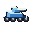 | **Coyote AC-8** — Road tank | 8 Wheels | 50 hex 1 | — | 30 | Move and fire | Wheeled tank. Eight road hexes, gun 50, armor 30. Wasteland is closed. |
|  | **Jackal MB-9** — Road raider | 9 Wheels | 50 hex 1 | 10 hex 1 | 20 | Fire, then move | Shoots, then spends whatever movement remains. Nine hexes on a road; a plain costs 2. |
|  | **Ox T-55** — Tank with a roof gun | 4 Treads | 50 hex 1 | 20 hex 1 | 40 | Move and fire | Gun 50 and armor 40, movement 4, and a roof gun of 20. |
|  | **Aegis T-50** — Mobile block | 6 Treads | — | 30 hex 1 | 50 | Move and fire | Drives to a lane and holds it with armor 50. It has no ground weapon. |
|  | **Bulldog SG-2** — Assault gun | 4 Treads | 60 hex 2 | — | 40 | Move and fire | Attack 60 at hex 2, armor 40. It can move and fire, and it stays where it fired. |
|  | **Mammoth SG-70** — Slow heavy gun | 2 Treads | 70 hex 2–5 | — | 40 | Move or fire | Movement 2, move or fire. Range 5, attack 70, armor 40. |
|  | **Heron MR-4** — Dual-domain battery | 4 Treads | 40 hex 2–4 | 45 hex 2 | 30 | Move or fire | Ground 40 at hexes 2–4, and air 45 at hex 2. Both jobs, under the specialist at each. |
|  | **Redoubt SG-40** — Placed bunker gun | 0 Treads | 50 hex 2–3 | — | 50 | Placed | A placed gun for a local fight. Hexes 2–3, attack 50, armor 50. |
|  | **Merlin AD-2** — Second-ring anti-air | 6 Treads | 20 hex 1 | 60 hex 2 | 30 | Move and fire | Air attack 60 at exactly hex 2, and it may move and shoot in the same turn. |
|  | **Citadel AD-0** — Placed air nest | 0 Treads | 20 hex 1 | 50 hex 1 | 50 | Placed | A placed nest. Adjacent air attack 50, a light ground gun, armor 50. |
|  | **Burro NC-2** — Wasteland carrier | 5 Treads | 20 hex 1 | 10 hex 1 | 30 | Move and fire, Carries foot | Tracked carrier for foot units. It crosses wasteland, which costs 3. |

## Full design

## Ibex GX-41

Mountain mortar.

 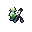  

**Decision.** Charlie and Kilroy are the only stock units that can stand on a mountain or in a valley, and both shoot only the adjacent hex. No gun in the roster can sit on that ground.

**Use.** Ibex walks onto a mountain (cost 2, so a move of 3 still arrives) or spends its move entering a valley, then fires at hexes 2 and 3 in the same turn. Attack 40 is Kilroy’s number, aimed past the contact hex. It harasses a tank on the plain below and it does not take the factory.

**Payment.** The adjacent hex is blind, so a unit that climbs up next to it receives no return fire. There is no anti-air weapon. Defense is 10; the mountain’s +40 is what keeps it alive, and that same +40 is why the base defense stays at Kilroy’s 10 instead of climbing. Capture stays with Charlie, Kilroy, Pipit, and Oryx.

**Trial.** Park it on a mountain and shell a Bison on a road at hex 2. Defense on that mountain is 10+40. Then send an Eagle. The aircraft is the answer unless Harrier is on the next hex.

**Beside.** Kilroy owns the adjacent hex and the factory. Ibex owns hexes 2 and 3 and owns neither the factory nor a countershot.

**Picture.** A small kneeling soldier with a short mortar tube and a bipod. No missile yellow: it is a gun.

Engine rings: ground 2–3, air none. Reach: Road 3, Plain 3, Hill 3, Waste 1, Mtn 1, Valley 1.

Nearest stock shapes: Hadrian SG-4 (19.7), Octopus MR-22 (20.1), Lenet TT-1 (20.3). Stacking screen 1.10, Giant 2.69.

## Harrier GX-52

Mountain anti-air.

 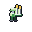  

**Decision.** Seeker cannot climb a mountain or enter a valley. Charlie’s air attack is 10, which does not threaten a Falcon. Aircraft strafe foot teams on high ground for almost nothing.

**Use.** Stand Harrier beside Ibex, or on the mountain approach to a base. An aircraft that comes adjacent to strafe takes an air attack of 50. The ground gun is 10, a sidearm against infantry that walk up.

**Payment.** It does not capture, so it is not a Kilroy with a better missile. Hexes past 1 are Merlin’s ring, not Harrier’s. Defense 10 means a tank that can reach the hex removes it; tanks cannot enter mountains, so the removal tool there is another gun or an aircraft.

**Trial.** On a mountain, Harrier’s defense is 50. An adjacent Eagle trades into that. A Falcon has no ground gun; if Harrier shoots first, Falcon still counters, because Falcon’s air range includes hex 1 and its air attack is 90.

**Beside.** Seeker is the vehicle that owns the adjacent air hex and can also fight on the flat. Harrier is the same ring on ground Seeker cannot enter.

**Picture.** A small standing soldier with two vertical shoulder missiles. Yellow on the warheads.

Engine rings: ground 1, air 1. Reach: Road 3, Plain 3, Hill 3, Waste 1, Mtn 1, Valley 1.

Nearest stock shapes: Charlie GX-77 (12.0), Seeker AAG-4 (15.1), Kilroy GX-87 (15.9). Stacking screen 1.16, Giant 2.69.

## Pipit GX-44

Standoff capturer.

 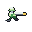 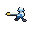 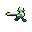

**Decision.** Every stock capturer has to stand next to a defender to hurt it, and then takes the counter. There is no capturer whose shot starts at hex 2.

**Use.** From two hexes out, Pipit fires at attack 40, Kilroy’s gun, and the defender does not counter because the exchange is indirect. On a later turn it walks onto the factory or the enemy base. Foot movement still crosses hills, wasteland, mountains, and valleys.

**Payment.** There is no retreat after the shot. The turn it stands on the factory, a garrison on an adjacent hex is at range 1 and the missile cannot see it. There is no air weapon. Defense is 10. One capturer gets this privilege; it does not also get the buggies’ escape.

**Trial.** A defender stands on the factory. Pipit shoots from hex 2. Next turn Pipit enters the factory. If the defender stepped off to an adjacent hex, Pipit has no shot at it that turn. If the defender stayed two hexes from the factory, the missile still reaches.

**Beside.** Kilroy captures and fights the hex he is touching, at move 2. Pipit captures and fights only hex 2, at move 3.

**Picture.** A small running soldier with one long horizontal missile. Yellow on the nose.

Engine rings: ground 2, air none. Reach: Road 3, Plain 3, Hill 3, Waste 1, Mtn 1, Valley 1.

Nearest stock shapes: Kilroy GX-87 (22.3), Lenet TT-1 (25.3), Charlie GX-77 (26.8). Stacking screen 1.30, Giant 2.69.

## Oryx CBX-3

Road capturer.

   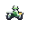

**Decision.** Panther is the only fast capturer, and its gun is 10. Kilroy can fight and capture, and he walks. A defended road factory has no capturer that both arrives on the road and hits harder than a sidearm.

**Use.** Send Oryx down a road to a factory held by infantry. Six road hexes, then a direct shot at 30, and it can take the building. The air attack of 10 is the same pea-shooter Panther carries, enough to answer a strafing run with a scratch.

**Payment.** Move is 6 against Panther’s 9, so Panther still arrives first. A plain costs 2, a hill costs 4, and wasteland, mountains, and valleys are closed. The shot is adjacent, so the defender counters. Defense 20 still loses to a tank. It is a motorcycle, and Burro does not carry it.

**Trial.** One road, six hexes, a Charlie on the factory. Oryx arrives and shoots at 30. The same distance on plains takes two turns. Panther on that road still gets there with move 9 and shoots at 10.

**Beside.** Panther is the courier. Oryx is the capturer you send when someone is standing on the building.

**Picture.** A motorcycle: two wheels, a small rider, a forward gun, and a short rear missile.

Engine rings: ground 1, air 1. Reach: Road 6, Plain 3, Hill 1, Waste —, Mtn —, Valley —.

Nearest stock shapes: Panther CBX-1 (6.4), Kilroy GX-87 (10.5), Charlie GX-77 (12.7). Stacking screen 1.67, Giant 2.69.

## Coyote AC-8

Road tank.

 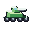  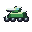

**Decision.** Every stock tank is tracked. The only wheeled fighter is Panther, whose job is capture and whose gun is 10. The road net has no tank.

**Use.** Coyote runs the highway: eight road hexes and a gun of 50, the same ground attack as Bison, and it does not capture, so it can be spent on a fight. On a plain it makes four hexes. On a hill it makes two.

**Payment.** Wasteland, mountains, and valleys are closed. There is no anti-air gun, so an Eagle strafes it and receives nothing back. Armor is 30, under Slagger’s 50, and the chassis cannot follow a tracked fight off the road. Direct fire means it takes the counter.

**Trial.** A road race against a Slagger toward a bridge. Coyote has eight hexes to Slagger’s seven, then has to stop being a tank the moment the ground turns to wasteland. An Eagle over the road is unanswered.

**Beside.** Slagger is the fast tracked tank. Coyote is the fast tank that exists only while the road does. Lenet is the nearest shape on the distance score, because the gun and the armor sit close; the map difference is eight road hexes against five, and a closed wasteland.

**Picture.** An enclosed four-wheel armored car with a turret and a cannon. No missiles and no tracks.

Engine rings: ground 1, air none. Reach: Road 8, Plain 4, Hill 2, Waste —, Mtn —, Valley —.

Nearest stock shapes: Lenet TT-1 (2.9), Bison S-61 (4.7), Slagger GS-81 (6.5). Stacking screen 1.82, Giant 2.69.

## Jackal MB-9

Road raider.

   

**Decision.** Rabbit and Lynx shoot and keep moving, and both pay tracked costs, so the trick works in wasteland and on hills. The road version of that raid does not exist.

**Use.** On a road, Jackal can spend part of nine hexes, fire at attack 50, and use the rest to leave. The air attack of 10 is Rabbit’s pea-shooter. It does not capture.

**Payment.** A plain costs 2, so four hexes of approach leave one point, and the retreat is a single hex. A hill costs 4. Wasteland, mountains, and valleys are closed. Attack is 50 against Rabbit’s 70. Defense is 20. Off the road it is a slow buggy that cannot run away.

**Trial.** Count the points left after the shot. On a road with the target three hexes out, six remain for the escape. On plains, with the target two hexes out, the cost is 4 and five remain — the escape is real but short. In wasteland there is no Jackal at all.

**Beside.** Rabbit is the raid that crosses wasteland at attack 70. Jackal is the raid that lives on the highway at attack 50.

**Picture.** An open four-wheel frame with a roll bar, a forward gun, and a small missile. The hull is a cage, not an armored car.

Engine rings: ground 1, air 1. Reach: Road 9, Plain 4, Hill 2, Waste —, Mtn —, Valley —.

Nearest stock shapes: Rabbit MB-5 (6.1), Lynx MB-4 (14.4), Panther CBX-1 (17.8). Stacking screen 2.17, Giant 2.69.

## Ox T-55

Tank with a roof gun.

   

**Decision.** Giant is the only stock tank that can shoot an aircraft, and Giant moves 2, cannot enter wasteland, and attacks at 90. Every ordinary tank takes an Eagle’s strafe and fires nothing back.

**Use.** Treat Ox as a Bison that answers the adjacent aircraft. Ground attack 50 and defense 40 match Bison. The roof gun is 20. Against an Eagle, defense 30 and no terrain, that is 14 damage per strength point before experience, squad size, and the random multiplier.

**Payment.** Movement is 4. Bison’s is 6 and Lenet’s is 5. Two points of approach is the payment for the roof gun; one point would have been a straight improvement on Lenet, who already moves 5 with a smaller gun and thinner armor. The roof gun does not replace Seeker, whose air attack is 65. Direct fire, so tanks counter it and it counters them.

**Trial.** One map with Eagles and one without. With aircraft, the roof gun is the reason to take the shorter move. Without aircraft, Bison’s two extra hexes are the better tank.

**Beside.** Bison is the same gun and the same armor at move 6, with an empty sky. Ox spends two hexes of approach on a reply.

**Picture.** A low tracked tank, a turret, a cannon, and a small machine-gun stub on the roof. The stub is metal, not a missile.

Engine rings: ground 1, air 1. Reach: Road 4, Plain 4, Hill 2, Waste 1, Mtn —, Valley —.

Nearest stock shapes: Seeker AAG-4 (12.9), Bison S-61 (14.6), Rabbit MB-5 (16.1). Stacking screen 1.74, Giant 2.69.

## Aegis T-50

Mobile block.

   

**Decision.** Trigger blocks a hex and cannot move. Every tank that can move also kills. There is no unit whose product is a zone of control you can drive into place.

**Use.** Move up to six hexes onto a bridge, a road, or a hill and stop the lane. Entering its zone of control ends a move, the same as any unit. Armor 50 is how long the block lasts. The air gun of 30 fires only at an adjacent aircraft, so an Eagle that lands on it takes a hit.

**Payment.** A ground attack receives no return fire, because there is no ground weapon. It does not capture and it carries nothing. Armor 50 plus a hill is 70, plus wasteland is 80, plus a base is 85, all before defense support and all under the cap of 100. Defense 80 on a hill is already 100, which is why this is 50. Artillery and aircraft are how the block comes up. Surround still halves the total after terrain.

**Trial.** Place it on a hill (defense 70) in a one-hex lane and send a Grizzly, attack 70. Then place it on a road (defense 50) and send the same Grizzly. The hill case is the one to time. A Hadrian shells it without a counter, because the exchange is indirect and Aegis has no ground gun anyway.

**Beside.** Trigger is the block you drop and never move, at defense 80. Aegis is the block you can reposition, at defense 50, and it shoots back only at an adjacent aircraft.

**Picture.** A turretless tracked wedge, wide side skirts, a small upward gun, and no missiles.

Engine rings: ground none, air 1. Reach: Road 6, Plain 6, Hill 3, Waste 2, Mtn —, Valley —.

Nearest stock shapes: Seeker AAG-4 (23.1), Hawkeye MM107 (27.9), Lynx MB-4 (29.1). Stacking screen 1.64, Giant 2.69.

## Bulldog SG-2

Assault gun.

   

**Decision.** Lynx is the only stock unit that shoots a ground target at exactly two hexes and still acts in the same turn, and Lynx’s payment is attack 40, defense 20, and a retreat. The long guns hit harder and must choose between moving and firing.

**Use.** Walk Bulldog into position and fire at hex 2 in that turn, at attack 60, Octopus’s punch, on a single ring. Armor is 40, so it can sit behind the unit it is supporting. Move 4 crosses a plain and still shoots, and it can enter wasteland (cost 3) with a point left over.

**Payment.** A tank that steps adjacent receives no counter. There is no retreat, so the gun remains on the hex it revealed. There is no anti-air weapon. Range 2 is the whole reach: hexes 3 and beyond belong to Octopus, Hadrian, and Mammoth. Stock guns at range 4 and beyond are move-or-fire. This one is range 2, so it keeps an ordinary turn without borrowing the buggy escape.

**Trial.** Support a Bison from the hex behind it. Then let a Grizzly step onto the Bison’s hex and continue onto Bulldog. The second step is the blind spot. Lynx, in the same geometry, would have shot and left.

**Beside.** Lynx shoots hex 2 and leaves, at attack 40 and defense 20. Bulldog shoots hex 2 and holds, at attack 60 and defense 40.

**Picture.** A tracked casemate with a very short, thick barrel. No missiles.

Engine rings: ground 2, air none. Reach: Road 4, Plain 4, Hill 2, Waste 1, Mtn —, Valley —.

Nearest stock shapes: Titan GT-86 (12.4), Bison S-61 (13.1), Grizzly T-79 (13.3). Stacking screen 1.71, Giant 2.69.

## Mammoth SG-70

Slow heavy gun.

 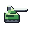  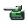

**Decision.** Hadrian and Octopus move 4. Atlas moves 0. There is no heavy gun on the rung between a self-propelled battery and a piece that has to be carried.

**Use.** Fire at hexes 2 through 5 at attack 70, with armor 40. On a turn it does not fire, it can shift two road or plains hexes, or one hill. It is the gun you place near the fight when Atlas’s range of 6 is more than the map needs and Hadrian’s attack of 45 is less than the target deserves.

**Payment.** Move or fire, and the move is 2. A hill spends the whole turn. Wasteland costs 3, so Mammoth cannot enter it. The adjacent hex is blind. There is no anti-air weapon. Atlas still outranges it and outhits it; Hadrian still repositions in half the time.

**Trial.** A target five hexes away that will move. Mammoth fires, or it steps two hexes and is silent. Atlas, already placed, fires at 90 out to hex 6 and does not step at all. Hadrian steps four and gives up the shot, at attack 45.

**Beside.** Hadrian is range 5 at attack 45, defense 30, move 4. Atlas is range 6 at attack 90, defense 20, move 0. Mammoth is range 5 at attack 70, defense 40, move 2.

**Picture.** A deep hull, a tall shield, and a long barrel. The barrel is the silhouette. No missiles.

Engine rings: ground 2–5, air none. Reach: Road 2, Plain 2, Hill 1, Waste 0, Mtn —, Valley —.

Nearest stock shapes: Hadrian SG-4 (7.0), Octopus MR-22 (7.4), Grizzly T-79 (18.5). Stacking screen 1.65, Giant 2.69.

## Heron MR-4

Dual-domain battery.

   

**Decision.** No stock battery can shoot ground and air. Hawkeye shoots air at hexes 2–5 and cannot touch a tank. Octopus shoots ground at hexes 2–4 and cannot touch an aircraft.

**Use.** Bring Heron when the battle has both tanks and aircraft and the scenario gives you one gun slot. Ground attack 40 covers hexes 2, 3, and 4. Air attack 45 covers hex 2 only. Move 4, and the turn is move or fire, the same discipline as Hadrian and Hawkeye. Defense 30 matches those batteries.

**Payment.** Octopus hits the same ground rings at 60. Hawkeye hits air at 85 out to hex 5. Heron is under both, and both of its weapons are blind at hex 1, so an adjacent tank or an adjacent Eagle takes no counter. It is one dual-domain gun, not a second Hawkeye welded to a second Octopus.

**Trial.** A tank at hex 3 and an Eagle at hex 2, on different turns. Heron can engage each and will do less than the specialist you did not bring. Then walk a tank onto the adjacent hex: no counter from Heron.

**Beside.** Octopus is the ground battery at these rings. Hawkeye is the air battery. Heron is the compromise when the scenario has room for one of them.

**Picture.** A tracked hull, a medium cannon pointed forward, and upward missiles at the rear. Yellow on the missiles only.

Engine rings: ground 2–4, air 2. Reach: Road 4, Plain 4, Hill 2, Waste 1, Mtn —, Valley —.

Nearest stock shapes: Octopus MR-22 (19.4), Hadrian SG-4 (19.8), Hawkeye MM107 (29.5). Stacking screen 1.97, Giant 2.69.

## Redoubt SG-40

Placed bunker gun.

   

**Decision.** Atlas is the only placed gun. It reaches hexes 2–6 at attack 90 and its defense is 20, so the counterbattery problem is the whole design. There is no placed gun you drop because the fight is close and you want the piece to last.

**Use.** Unload Redoubt on a plain, a road, a bridge, or an owned factory, behind the hexes you mean to hold. It fires at hexes 2 and 3 at attack 50. Armor 50 is the reason to take the short range. On a plain that defense is 55. Relocation is another transport ride.

**Payment.** Atlas still reaches hex 6 at attack 90. Redoubt cannot see hex 4 or beyond, and it cannot see aircraft; that is Citadel’s nest. An infantry unit that steps adjacent is safe from the gun. It never moves under its own power. Mule does not carry it. Pelican does, onto the usual unloading tiles.

**Trial.** A three-hex approach to a factory. Redoubt behind the factory covers the approach and survives a Hadrian longer than Atlas would. The same piece on a wide map watches the enemy walk around hex 3.

**Beside.** Atlas is the siege tube: range 6, attack 90, defense 20. Redoubt is the local piece: range 3, attack 50, defense 50.

**Picture.** A sandbag revetment, a thick shield, a medium gun, and a split trail. No missiles, no legs.

Engine rings: ground 2–3, air none. Reach: Road 0, Plain 0, Hill 0, Waste 0, Mtn 0, Valley 0.

Nearest stock shapes: Atlas SS-80 (17.2), Trigger M-77 (22.6), Octopus MR-22 (24.9). Stacking screen 1.38, Giant 2.69.

## Merlin AD-2

Second-ring anti-air.

   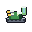

**Decision.** Seeker shoots aircraft only when they are adjacent, and it can move and fire. Hawkeye shoots hexes 2–5 at attack 85, and the turn it moves it cannot fire. Hex 2 has no unit that can both reach it and still have moved this turn.

**Use.** Merlin moves up to six hexes and fires at an aircraft on hex 2, at attack 60. The ground gun is 20 and adjacent, so infantry cannot simply stand on it, and it is not a tank. Defense 30 matches Seeker and Hawkeye.

**Payment.** An aircraft on hex 1 is Seeker’s target, and Merlin’s missile cannot see it. An aircraft on hex 3 or beyond is Hawkeye’s, if Hawkeye has already set. Air attack 60 is under Seeker’s 65 and well under Hawkeye’s 85. The ground gun loses to any tank. Tracked movement, so it crosses hills at cost 2 and wasteland at cost 3, and it cannot climb a mountain; Harrier can.

**Trial.** An Eagle orbiting at hex 2, with Merlin still out of position at the start of the turn. Merlin can move and shoot. Hawkeye in the same spot can move or shoot. Then have the Eagle drop to hex 1: Merlin goes silent and Seeker, if present, does not.

**Beside.** Seeker owns hex 1 and a real ground gun. Hawkeye owns hexes 2–5 on a turn it does not move. Merlin owns hex 2 on a turn it does.

**Picture.** A tracked box launcher, a flat radar panel, and twin missiles at a shallow angle. Yellow on the missiles.

Engine rings: ground 1, air 2. Reach: Road 6, Plain 6, Hill 3, Waste 2, Mtn —, Valley —.

Nearest stock shapes: Seeker AAG-4 (12.1), Lenet TT-1 (23.4), Bison S-61 (24.9). Stacking screen 2.09, Giant 2.69.

## Citadel AD-0

Placed air nest.

   

**Decision.** Trigger is the placed block, and it cannot shoot. Atlas is the placed gun, and it cannot see aircraft. A factory garrison has no nest that answers the Eagle on the adjacent hex.

**Use.** Unload Citadel on a plain, a road, a bridge, or an owned factory. It shoots an adjacent aircraft at 50 and an adjacent ground unit at 20, and because both weapons include hex 1 it can counter. Armor 50 makes it a worse wall than Trigger and a better wall than Atlas. It stays where it was unloaded.

**Payment.** Anything at hex 2 or beyond ignores it. Merlin and Hawkeye own those rings. Ground attack 20 does not stop a tank; it scratches infantry and it does answer. Defense 50 against Trigger’s 80 is the price of having a gun. Mule does not carry it. It cannot relocate without a transport, and it cannot climb onto a mountain by itself.

**Trial.** A factory, a Charlie, and an Eagle. Citadel on the factory tile (terrain defense 0, so armor stays 50) shoots the Eagle that comes adjacent. An Eagle that stays at hex 2 is untouched. A Grizzly that walks up takes a ground attack of 20 and then dismantles the nest.

**Beside.** Trigger blocks and never shoots, at defense 80. Citadel shoots the adjacent hex and blocks less, at defense 50.

**Picture.** Four braced feet, a low box, two vertical missiles, and a small ground barrel. Tall, where Redoubt is wide and bagged.

Engine rings: ground 1, air 1. Reach: Road 0, Plain 0, Hill 0, Waste 0, Mtn 0, Valley 0.

Nearest stock shapes: Seeker AAG-4 (25.4), Giant HMB-2 (30.7), Mule NC-1 (35.0). Stacking screen 1.44, Giant 2.69.

## Burro NC-2

Wasteland carrier.

   

**Decision.** Mule is wheeled, so wasteland, mountains, and valleys are closed to it, and its defense is 10. Pelican flies over wasteland and cannot land there. No carrier can walk a Kilroy across the ash.

**Use.** Load Charlie, Kilroy, Ibex, Harrier, or Pipit and cross wasteland at cost 3, or a hill at cost 2. Armor 30 is there so the crossing is not free food. The gun is 20 ground and 10 air, adjacent, in the same band as a light truck: it shoots back, and it is not a fighting vehicle. On a road it makes five hexes to Mule’s six.

**Payment.** It does not carry Oryx, tanks, guns, nests, Atlas, or Trigger. Those stay with Pelican, and Atlas and Trigger stay with Mule. Mountains and valleys are closed to tracks. Move 5 does not outrun Mule on a road. One passenger. Pelican remains the fast delivery onto plains, roads, bridges, and owned factories, and Pelican still cannot drop anyone into wasteland.

**Trial.** A belt of wasteland between a factory and the fight, with a Kilroy that needs to be on the far side. Mule stops at the edge. Pelican cannot land in the ash. Burro spends 3 to enter and has 2 left. The same Kilroy on a road should still ride Mule, which is faster there and was built for that road.

**Beside.** Mule is the road truck: move 6, wheels, defense 10, and it carries Charlie, Kilroy, Atlas, and Trigger. Burro is the ash truck: move 5, tracks, defense 30, and it carries foot teams.

**Picture.** A tracked cab with a windshield, an open cargo bay behind it, and a small gun. The hole in the hull is the load.

Engine rings: ground 1, air 1. Reach: Road 5, Plain 5, Hill 2, Waste 1, Mtn —, Valley —.

Nearest stock shapes: Mule NC-1 (11.3), Seeker AAG-4 (14.3), Panther CBX-1 (16.8). Stacking screen 1.57, Giant 2.69.

## How this set was chosen

The other proposal, in tools/design-space, draws stat lines and keeps the fifteen furthest from the occupied roster. Its own notes say that distance prefers boundaries, and they name four results that need a trial before a scenario slot: Midge at air attack 10, Badger at one wheeled movement point, Hydra at very high firepower on both domains, and the defense-80 designs, which meet the defense cap of 100 once terrain is added. No transport made that top fifteen. Names were assigned after the numbers.

This set uses those notes as limits. Foot defense stays at 10, because a mountain already adds 40 and a higher base turns a team into a fort. No gun is given the specialist’s attack on both domains at once. No wheeled unit is given a single movement point. The carrier is here because getting infantry across wasteland is a missing decision, even though a carrier sits close to Mule in a pure stat distance.

Jobs and numbers were chosen together. Each unit adds one privilege and pays with a limit the stock unit in that job does not have. The stacking screen from the numerical study is reported beside each unit as a comparison figure only. It is not a win rate, and it does not account for maps, pairing, or who shoots first.

Defense is added to terrain, then capped at 100, and only then does surround halve it. Indirect fire still receives terrain defense. It does not receive support, surround, or a counterattack. Unloading still happens on plains, roads, bridges, and owned factories. Trigger and Atlas are left out of some elimination counts by their own ids; a placed proposal would count.

Nothing here changes capture, zones of control, damage, experience, or transport rules. Air units are outside this set. The stock aircraft remain Eagle, Falcon, and Hunter.

## Checks

This build passed: 15 units inside the declared bounds and under Giant on the stacking screen; no dominance either way against the stock 19 or against each other; engine firing rings; engine reach on road, plain, hill, waste, mountain, and valley; Pelican accepts every proposal; Mule accepts none; Burro accepts only Charlie, Kilroy, Ibex, Harrier, and Pipit. Icons are original 32×32 frames, both facings, Union and Xenon, inside the hex mask, with distinct silhouettes and small foot soldiers.

## Files

- `index.html` — overview table, dossiers, contact sheet
- `units.json` — editor custom-definition object
- `icons/` — 60 PNGs, 32×32
- `sheet.png` — contact sheet
- `units.js`, `icons.js`, `build.js` — sources
