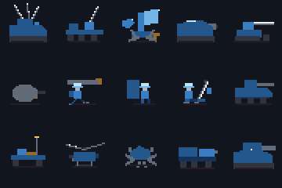

# museSpark1.3 — 15 job-driven gap-fillers (proposal, not roster)

Status: experimental proposal. Nothing here modifies the playable roster or
maps. `custom-units.json` is engine-readable (editor import shape) and passes
`validate.js` (loads through `mergeUnitTypes`, no duplicate stock statline).
Icons are original 32x32 indexed pixels in the project style; `gallery.html`
is the visual overview. Balance is untested; every dossier ends with the
playtest that would falsify it.

## Review of Project Outline: "Fifteen Numerical Ground-Unit Concepts"

In `PROJECT_GUIDE.md` (line 42), the pending/research outline records:
> `Fifteen numerical ground-unit concepts | Experimental proposals, not additions to the playable roster. Numerical coverage is not evidence of balance; artwork is a separate review pack. [Study, assumptions and playtesting needs](tools/design-space/README.md).`

### Analysis of the Prior Design-Space Study (`tools/design-space/`)
1. **Methodology & Mathematical Premise:**
   The prior artifact used a deterministic 240,000-draw Monte Carlo maximin search across a 5-dimension feature vector: Firepower (25%), Armor (15%), Range bands (20%), Terrain reach/access (20%), and Turn/mission rules (20%). It screened candidates against an arbitrary power budget ceiling derived from stock units, then sequentially greedily picked configurations that maximized distance to the nearest existing unit.
2. **What the Numerical Study Revealed:**
   The 1989 PC Engine Nectaris roster (23 units, 19 ground units) clusters tightly around conventional archetypes. Across 25,858 admissible configurations, the mathematical study lowered mean nearest-unit distance from 22.27 to 16.85 (a 24.3% reduction).
3. **Critical Design Flaws of Pure Maximin Dispersion:**
   As the study's own `README.md` honestly noted, maximin optimization inherently hunts extreme corners and boundary cases of the bounding box:
   - **Degenerate mobility:** Units like Badger CBX-8 were assigned 1 movement point on wheels. Because entering plains on wheels costs 2 points and hills 4 points, a 1-move wheeled unit is physically trapped on roads and cannot traverse off-road terrain in a single activation.
   - **Tactical irrelevance:** Midge GX-12 was assigned 10 air attack, 0 ground attack, and no capture ability. In a game without a purchase economy or reinforcement points, a scenario slot cannot justify a unit that deals negligible attrition.
   - **Artificial roadblocking:** Rampart HV-90 gave up all ground attack for 80 defense and 9 tracked movement, functioning as an un-counterable movement sponge rather than a combat entity.
   - **Distorted damage ceilings:** Hydra MR-90 combined 90 ground attack and 85 air attack at range 2–3 on a 1-move crawler, creating an un-interactive artillery piece that warped screening math.
   - **Defense-cap clipping:** Multiple 80-defense selections could reach the engine's 100-defense combat cap simply by parking on hills or receiving defensive support.

### The Grok 4.7 Tactical Reframe
A strategy wargame is not a coordinate-dispersion problem; it is an engine of operational trade-offs, tempo, and combined-arms doctrine. In Nectaris, units exist within strict system rules:
- **Terrain movement costs:** Foot (mountain access), Wheels (road sprint, rough ground penalty), Treads (balanced cross-country), and Air (flat 1 cost, no terrain defense).
- **Combat dynamics:** Zone of Control (ZOC), Surround defense reduction, Support fire bonuses from adjacent friendlies.
- **Indirect fire rules:** Firing bands at range $N > 1$ cannot attack adjacent hexes ($d=1$), and indirect attacks allow no counter-fire or support from the defender.
- **Action economy:** Move-then-fire, Move-or-fire, Move-after-attack (hit-and-run retreat), and Transport logistics (Pelican / Mule loading constraints).

The `museSpark1.3` set replaces geometric boundary sampling with **operational role fulfillment**: 15 distinct, combat-viable units designed to answer real battlefield dilemmas that scenario designers and players encounter. Every unit has:
1. A specific operational mission absent from the stock 23-unit roster.
2. A direct counter already present in the stock roster.
3. A realistic transport integration story.
4. No degenerate mobility or defense cap exploitation.

## Design rules for this set

1. Every unit has a job a scenario designer would assign, a counter already
   in stock, and a transport story. No unit without all three.
2. No unit obsoletes a stock unit: each keeps a sharp weakness (blind ring,
   tempo cost, terrain leash, or fragility) spelled out in its dossier.
3. Different cut from the numerical set: jobs and tempos, not stat-space
   extremes. Where a number lands near a numerical proposal, the role differs.
4. Deliberate exclusions: no air indirect fire (no stock precedent, AI and UI
   assume direct air combat), no capture from the air, no cargo capacity above
   1, no second economy mechanic (there is no purchase economy to price against).

## Overview

Band notation: `1` direct, `2` exactly two hexes, `2–3`/`2–4` indirect bands.
Turn: THEN = move then fire, OR = move or fire, RET = fire then keep moving,
ST = stationary. Cap = captures buildings.

| # | Icon | Name | Class | Move | Ground | Air | Def | Turn | Cap | Transport | Job |
|---|---|---|---|---|---|---|---|---|---|---|---|
| 1 |  | Aegis AA-60 | antiair | 3 tr | 20 / 1 | 70 / 2 | 60 | THEN | — | Pelican | Armored AA anchor for the gun line |
| 2 |  | Gadfly AD-31 | antiair | 8 wh | 10 / 1 | 55 / 1 | 15 | THEN | — | Pelican | Fast road-bound AA response |
| 3 |  | Argus AD-77 | antiair | 0 | — | 60 / 2–4 | 30 | ST | — | Pelican place | Static air-denial umbrella, no ground gun |
| 4 |  | Breacher SG-9 | artillery | 4 tr | 55 / 2–3 | — | 35 | THEN | — | Pelican | Assault gun: advances and fires same turn |
| 5 |  | Longbow AT-22 | artillery | 5 tr | 75 / 2 | — | 25 | OR | — | Pelican | Mobile AT gun, hard punch at exactly 2 |
| 6 |  | Redoubt FP-80 | artillery | 0 | 60 / 2 | — | 70 | ST | — | Pelican place | Armored pillbox for factory mouths |
| 7 |  | Javelin GX-90 | infantry | 3 ft | 85 / 1 | — | 10 | RET | — | Pelican | Foot tank-hunters, strike and slip away |
| 8 |  | Pavise GX-55 | infantry | 2 ft | 20 / 1 | 10 / 1 | 30 | THEN | Yes | Pelican | Shield infantry that takes ground and holds it |
| 9 |  | Trench GX-41 | infantry | 2 ft | 35 / 2–3 | — | 10 | OR | Yes | Pelican | Mortar capturer: fire support that seizes |
| 10 |  | Duster AC-12 | tank | 7 wh | 45 / 1 | 30 / 1 | 20 | THEN | — | Pelican | Wheeled gun car, road fighter with light AA |
| 11 |  | Whippet MB-7 | buggy | 10 wh | 20 / 1 | 20 / 1 | 10 | RET | — | Pelican | Fastest ground unit; pokes and withdraws |
| 12 |  | Condor CA-9 | transport | 7 air | 20 / 1 | 20 / 1 | 30 | THEN | — | carries 1 ground | Armed lift: escorts its own passenger |
| 13 |  | Tick M-3 | mine | 3 tr | — | — | 70 | — | — | Pelican | Walking mine: mobile obstruction and ZOC |
| 14 |  | Hauler NC-7 | transport | 5 wh | 30 / 1 | 20 / 1 | 30 | THEN | — | carries 1 foot | Gun truck: fights while carrying infantry |
| 15 |  | Slogger HMB-9 | tank | 3 tr | 80 / 1 | — | 60 | THEN | — | Pelican | Waste-capable siege tank, slow breakthrough |

Sheet (Union, right-facing): 

## Dossiers

### 1. Aegis AA-60 — armored AA anchor
Gap: the only ground AA with reach is Hawkeye (fragile, move-or-fire, blind
within 1); Seeker must stand adjacent to shoot air. No AA unit can hold a
position in the line.
Use: park in the gun line; its air band 2 plus adjacent direct fire covers
approaches while 60 defense survives bombardment that kills Seekers.
Price: 3 tracked movement, weak 20 ground gun, no indirect. Tanks dismantle
it; artillery outranges it. Seeker keeps the mobility crown (6 vs 3).
Transport: Pelican lift; too slow to walk to distant fronts.
Playtest: does 60 defense + terrain + support reach the defense cap and stall
tank assaults? If so, cut defense to 50 first, not attack.
Art: slab hull, twin raised AA barrels, small radar block.

### 2. Gadfly AD-31 — fast wheeled AA
Gap: Seeker (6 tracked) is the fastest ground AA; nothing answers a Panther
thrust or air rush along roads.
Use: road sprint to intercept aircraft or punish light pushes; 55 air attack
threatens Eagle/Hunter, 10 ground gun keeps it from being free against infantry.
Price: defense 15, wheeled (no waste/mountain/valley, 4 per hill), direct
range only. Any tank kills it; hills stop it.
Transport: Pelican for off-road fronts.
Playtest: check 8 wheels + 55 AA does not retire Seeker; Seeker's tracked
access and 30 ground attack must remain the cross-country pick.
Art: open truck bed, gun shield, single AA barrel, cab glass.

### 3. Argus AD-77 — static air-denial umbrella
Gap: every AA unit is mobile; there is no cheap static air cover for depots
and Atlas parks. Hawkeye is overkill for that job and needs its 5-move chassis.
Use: Pelican-place over a staging area; air band 2–4 denies loitering.
Price: no ground weapon at all — any ground unit walks up unopposed. Immobile,
move-or-fire, defense 30.
Transport: Pelican placement only (not in Mule's whitelist).
Playtest: verify games do not devolve into Argus umbrellas over every factory;
cost in transport activations should be the limiter, tested on 28x28 maps.
Art: braced legs, tall radar vane, dish, paired missiles.

### 4. Breacher SG-9 — assault gun
Gap: all guns are move-OR-fire; no artillery advances and shoots in one turn.
Use: crawl 1–2 hexes and still fire at 2–3. Takes ground Octopus cannot reach
without losing a turn.
Price: 55 attack at 2–3 vs Octopus 60 at 2–4 and Hadrian 45 at 2–5 — shorter
and not harder. Defense 35, no air weapon.
Transport: Pelican.
Playtest: the no-moveOrFire flag on an indirect unit is the experiment; watch
for kiting loops against 4-move guns and confirm ZOC still pins it.
Art: turretless casemate, short thick gun, low assault silhouette.

### 5. Longbow AT-22 — mobile AT gun
Gap: no tracked unit fires indirectly at exactly two hexes except Lynx (40
attack, buggy). No dedicated tank destroyer.
Use: 5 tracked movement to a firing lane, 75 attack at exactly 2 against
Polar/Grizzly/Slagger pushes.
Price: move-or-fire, blind adjacent, defense 25, no air weapon. Dies to close
assault and any aircraft.
Transport: Pelican.
Playtest: 75 at exactly-2 vs Giant (80 def) and entrenched Polar; confirm the
adjacent blind spot keeps it screen-dependent.
Art: light carriage, very long thin barrel, small trail wheel.

### 6. Redoubt FP-80 — armored pillbox
Gap: Atlas is glass (20 def) and Trigger has no gun; no defensive position
combines armor with firepower.
Use: Pelican-place at factory mouths and passes; 60 attack at exactly 2 with
70 defense holds until besieged.
Price: immobile, blind adjacent, no air weapon. Long artillery, surround, and
any aircraft reduce it.
Transport: Pelican placement only.
Playtest: 70 defense + mountain/forest-equivalent terrain vs cap; if
unremovable except by Atlas, cut to 60.
Art: gray concrete mass, steel gun, faction roof plate.

### 7. Javelin GX-90 — foot tank-hunters
Gap: foot ground attack caps at Kilroy 40; no infantry threatens armor, and no
foot unit retreats after firing.
Use: walk hills/mountains tanks cannot cross, strike adjacent at 85, spend
remaining 3 foot movement to slip away (buggy tempo on foot).
Price: defense 10, no capture, no air weapon, direct range only — counterfire
applies, and it dies to any reply. Cannot stand in the open.
Transport: Pelican for mountain drops.
Playtest: the retreat-on-foot privilege is the risk; verify ZOC and the 3-move
budget keep escapes earned, not free.
Art: running operator, long shoulder tube with ordnance tip, backpack.

### 8. Pavise GX-55 — shield infantry that captures
Gap: foot defense caps at 10; no infantry holds terrain, and every capturer is
fragile on the objective.
Use: take factories and bases, then survive the counterattack on 30 defense;
20 attack contributes vs infantry and screens.
Price: 2 foot movement, weak attack — kills nothing armored. Artillery and
massed direct fire still clear it.
Transport: Pelican; walks the last hexes itself.
Playtest: does 30-def capture play obsolete Kilroy? Kilroy's 40 attack and
Pavise's 2-move must keep both employed.
Art: tall rectangular shield, helmeted holder, sidearm.

### 9. Trench GX-41 — mortar capturer
Gap: every capturer is a range-1 brawler; no infantry supports from range or
softens an objective before entering it.
Use: bombard at 2–3, then walk onto the factory on a later turn. First
capturer with indirect fire.
Price: move-or-fire, blind adjacent, defense 10, 35 attack — needs a screen
and dies to any adjacent assault.
Transport: Pelican.
Playtest: capture + indirect is a new privilege pair; confirm the blind ring
and fragility force escort play rather than solo objective runs.
Art: kneeling gunner, mortar tube, baseplate, sight block.

### 10. Duster AC-12 — wheeled gun car
Gap: Panther and Mule are the only wheeled vehicles and neither is a fighter;
roads have no combat vehicle of their own.
Use: road patrol and rapid response; 45 ground gun plus 30 light AA punishes
aircraft that loiter over roads.
Price: wheeled leash (no waste/mountain/valley), defense 20, direct only.
Tracked tanks and hills beat it.
Transport: Pelican off-road.
Playtest: 7 wheels + dual direct weapons vs Panther's capture niche; Duster
must not become the default scout — Panther's 9 move and capture hold that.
Art: armored car body, small turret, gun, cab glass.

### 11. Whippet MB-7 — recon buggy
Gap: no unit combines buggy retreat with wheels; Panther (9) is the fastest
ground unit and it cannot withdraw after contact.
Use: 10-wheel sprint, poke at 20/20, retreat with leftovers. Scout, ZOC
nuisance, Mule/Pelican hunter where landing zones are soft.
Price: 20/20/10 — threatens nothing directly; wheeled leash; ZOC traps kill it.
Transport: Pelican to cross its impassable terrain.
Playtest: fastest-ground-unit status must buy information, not kills; verify
10 wheels does not break opening factory races on road maps.
Art: light buggy frame, tall antenna, small missile, open cab.

### 12. Condor CA-9 — armed lift
Gap: Pelican is unarmed (0/0/10); every airlift needs an escort it cannot
provide for itself.
Use: carry one ground unit (any non-air, unloaded passenger per engine rules)
while contributing 20/20 direct fire and 30 defense. Self-escorting
Atlas/Tick delivery.
Price: 7 air movement vs Pelican 9 — slower; 20/20 guns lose to Falcon (90)
and Hawkeye; still needs fighter cover against real air defense.
Transport: is a carrier; cannot be carried.
Playtest: confirm armed-lift play does not retire Pelican; Pelican's 9 speed
and expendability must keep the fast-lift job.
Art: cargo box fuselage, cockpit glass, tandem rotors, belly gun.

### 13. Tick M-3 — walking mine
Gap: Trigger must be carried to its obstruction hex; no mobile unit sells its
activation purely for position and ZOC.
Use: walk 3 tracked into a lane and exist: 70 defense, projects ZOC, absorbs a
shot that would have hit something valuable.
Price: no attack at all — a free kill for any gun, and it never earns
experience by dealing damage. Pure tempo purchase.
Transport: Pelican to distant lanes.
Playtest: verify the price is real — if players never shoot it and it blocks
for free, defense is too high; tune to 60 before touching movement.
Art: lit dome, six thick legs, spikes, ordnance eye.

### 14. Hauler NC-7 — gun truck transport
Gap: Mule fights at 10/10 and carries a narrow whitelist; no transport
contributes in a fight while loaded.
Use: carry one foot unit (Charlie, Kilroy, Panther, Javelin, Pavise, Trench,
Tick) with 30/20 guns and 30 defense riding alongside.
Price: 5 wheels — slower than Mule (6) and road-leashed; narrow passenger
list; loses gun duels to real armor.
Transport: is a carrier; Pelican can lift it empty.
Playtest: Hauler + Pavise/Trench teams are the intended combo; confirm Mule
keeps the Atlas/Trigger heavy-lift monopoly.
Art: cab with glass, cargo bed, bed gun, six wheels.

### 15. Slogger HMB-9 — waste-capable siege tank
Gap: Giant is banned from wasteland and every 2–3 move tank is slow somewhere;
no breakthrough tank crosses waste (cost 3) under its own power.
Use: 3 tracked movement spends exactly full allowance to enter waste; 80
attack / 60 defense breaks fortified lines cross-country.
Price: 3 movement everywhere else, no air weapon, direct only. Outmaneuvered
by Slagger (7) and dismantled by Longbow/artillery at range.
Transport: Pelican for operational moves.
Playtest: waste access + 80/60 is the whole design; test waste-heavy maps
first and tune movement to 2 (waste-incapable) if it dominates them.
Art: extra-wide hull, skirt plates, short thick gun, heavy turret.

## Build and check

```sh
node museSpark1.3/icons.js     # 30 PNGs (Union right / Xenon left) + sheet.png
node museSpark1.3/validate.js  # engine load, ranges, icon presence, statline overlap
```

Icons use the shared 16-entry indexed palette; yellow marks ordnance only.
Six silhouettes have odd visible widths and were rounded 1px in centering;
they are proposal-grade, not exporter-validated production art.
