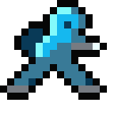
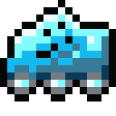
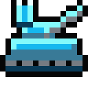
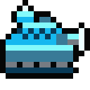
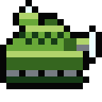
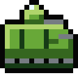
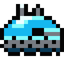
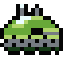
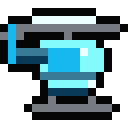

# Opus-Sonnet 5.5: fifteen gap-filling units

Generated by `node opus-sonnet-55/build.js`; do not edit. Source: `units.js` (rules and prose), `art.js` (icons), `analysis.js` (engine checks). Interactive overview: [`index.html`](index.html).

Status: **design study, not approved product requirements.** It answers the `PROJECT_GUIDE.md` item "design 15 gap-filling units" with one independent set. Nothing here is registered in the game.

## Overview

Range "2-3" means the unit fires at 2 or 3 hexes and cannot fire at 1; "1" means adjacent only. Reach is the farthest hex the unit can hit in one turn, from a full-move stop on open plains (and, in brackets, along roads), computed by the engine's own movement code. Union icon left, Xenon icon right.

| Icon | Unit | Type | Move | Rng G | Rng A | Atk G | Atk A | Def | Reach G | Reach A | Rules | Description |
|---|---|---|---:|---:|---:|---:|---:|---:|---:|---:|---|---|
|   | **Ibex** MM-2 | Foot | 3 | 2-3 | - | 40 | - | 6 | 3 | - | Move or fire | Mortar crew on foot: indirect fire from mountains no tracked gun can climb |
|   | **Nettle** SM-3 | Foot | 3 | - | 2-3 | - | 60 | 6 | - | 3 | Move or fire | Missile crew on foot: shoots aircraft 2-3 hexes away from any terrain |
|   | **Ferret** RS-4 | Foot | 4 | 1 | 1 | 35 | 15 | 6 | 5 | 5 | Move after attack | Skirmisher: strikes, then walks off with the movement it has left |
|   | **Locust** MR-9 | Wheels | 6 | 2-4 | - | 45 | - | 10 | 7 (10 road) | - | - | Rocket truck: the only long-range gun that moves and fires in one turn |
|   | **Cyclone** DB-2 | Tracked | 4 | 2-3 | 2-3 | 35 | 50 | 25 | 3 | 3 | Move or fire | Dual battery: one gun that answers ground or air at 2-3 hexes |
|   | **Warden** FG-5 | Tracked | 5 | 1 | 2-3 | 30 | 70 | 40 | 6 | 8 | - | Flak tank: guards a ring 2-3 hexes out, but adjacent aircraft are safe from it |
|   | **Stalker** TD-8 | Tracked | 5 | 1 | - | 85 | - | 45 | 1 | - | Move or fire | Hull-down hunter: 85 attack, but only when it has not moved |
|   | **Badger** AV-4 | Tracked | 4 | 1 | 1 | 25 | 15 | 40 | 5 | 5 | Carries 1 | Armored carrier: 40 defense, tracked, carries one ground unit through wasteland |
|   | **Rhino** AC-3 | Tracked | 3 | 1 | - | 35 | - | 35 | 4 | - | Captures | Armored capturer: takes factories and the base at 35 defense |
|   | **Redoubt** PB-1 | Fixed | - | 1 | 1 | 80 | 70 | 50 | 1 | 1 | Fixed | Pillbox: hits adjacent ground and air hard; cannot move |
|   | **Javelin** SM-8 | Fixed | - | - | 2-4 | - | 95 | 40 | - | 4 | Fixed | SAM site: 95 attack on aircraft 2-4 hexes out; nothing else |
|   | **Hornet** AH-5 | Air | 7 | 1 | 1 | 65 | 40 | 30 | 8 | 8 | Move after attack | Attack helicopter: strikes, then flies the rest of its move away |
|   | **Lancer** LX-2 | Air | 8 | 2-3 | - | 45 | - | 15 | 11 | - | - | Stand-off striker: air artillery, fires at 2-3 hexes after flying |
|   | **Merlin** AX-3 | Air | 10 | - | 2-3 | - | 70 | 15 | - | 13 | - | Missile interceptor: shoots aircraft 2-3 hexes out after flying its full move |
|   | **Dragonfly** JP-1 | Air | 4 | 1 | 1 | 10 | 10 | 4 | 5 | 5 | Captures | Jump-pack trooper: flying capturer that mountains cannot stop |

## How the set was chosen

The game has no purchase cost: a scenario lists what each side owns. A weaker copy of a stock unit is therefore not a gap, because nobody would field it. Every unit below opens a rule combination or a terrain access that no stock unit has, and is neither dominated by nor dominating any stock or new unit.

- **Gap screen.** Each unit carries a predicate for its empty cell. `analysis.js` runs it over all 23 stock units and requires zero matches.
- **Dominance screen.** 1110 ordered pairs were compared on move, defense, both attacks, firing band, capture, cargo, fire policy and terrain costs. Aircraft and ground units are never compared. No unit dominates another.
- **Engine facts.** Every number in the unit sections comes from the game's own engine (`js/engine.js`) driven by `analysis.js`, not from arithmetic done by hand.
- **Icons.** 16x16 art pixels doubled to 32x32, the seven Legacy chart colours, a black contour, right-facing art mirrored for left. `unit-art.json` follows the `art/legacy` frame format.

### The set by chassis

- **Foot teams** (3): Ibex, Nettle, Ferret. Infantry chassis: mountains and valleys open, wasteland cheap.
- **Wheels** (1): Locust. Fast on roads, shut out of mountains, valleys and wasteland.
- **Tracked** (5): Cyclone, Warden, Stalker, Badger, Rhino. The fighting-vehicle chassis.
- **Fixed positions** (2): Redoubt, Javelin. Move 0; brought in by transport or factory exit.
- **Air** (4): Hornet, Lancer, Merlin, Dragonfly. Terrain-free; only anti-air weapons can shoot back.

### Gap map

| Empty cell in the stock roster | Unit | Stock units already there | Other new units there |
|---|---|---|---|
| Indirect ground fire on a chassis that enters mountains and valleys | Ibex | none | none |
| Anti-air fire on a chassis that enters mountains and valleys | Nettle | none | none |
| Infantry that may move after attacking | Ferret | none | none |
| Range 3 or more with a normal move-then-fire turn | Locust | none | LANCER |
| Indirect fire at both ground and air targets | Cyclone | none | none |
| Direct ground weapon plus indirect anti-air on one vehicle | Warden | none | none |
| A direct-fire unit that must choose move or fire | Stalker | none | none |
| A ground transport with 40 defense and tracked terrain access | Badger | none | none |
| A tracked unit that can capture | Rhino | none | none |
| A fixed unit with a direct-fire weapon | Redoubt | none | none |
| A fixed anti-air weapon | Javelin | none | REDOUBT |
| An aircraft that may move after attacking | Hornet | none | none |
| An aircraft with indirect ground fire | Lancer | none | none |
| An aircraft with indirect anti-air fire | Merlin | none | none |
| An aircraft that can capture | Dragonfly | none | none |

## Units

### Ibex MM-2

 

*Mortar crew on foot: indirect fire from mountains no tracked gun can climb.*

Foot | Move 3 | Range ground 2-3, air - | Attack ground 40, air - | Defense 6 | Move or fire

Reach on ground targets 3; on aircraft -.

**Fills:** Indirect ground fire on a chassis that enters mountains and valleys.

**What it is.** A two-man mortar crew. It shells ground targets at 2 or 3 hexes, draws no counter, and follows the guns' move-or-fire turn. What sets it apart is the chassis: mountains cost 2 and valleys are open to it, so it can stand where Hadrian, Octopus and Atlas physically cannot.

**How it plays.** A mountain ridge stops being a wall for artillery. On a peak an Ibex takes the mountain's +40 defense and shells the plain below; on the plain it is the softest target on the board. The player chooses between the slow climb to a peak and the flat, where it is exposed.

**Beaten by.** Anything that gets adjacent: it cannot shoot at range 1 and never counters. The units placed beside it are its only defense.

**Pairs with.** Charlie or Kilroy walking beside it to hold the adjacent ring; a Pelican to hop it onto a ridge.

**Watch in play tests.** Move 3 and move-or-fire make a mountain approach take many turns; the ridge must be near a front for it to matter.

**Checked in the engine:**

- Shells a full Bison on plains at range 3: 1.9 of 8 lost, no counter.
- Mountain hexes cost it 2 movement; Hadrian, Octopus, Atlas cannot enter them at all.
- A Bison attacking it costs 3.8 of 8 on plains and 2.3 of 8 on a mountain.
- After any move it cannot fire until the next turn.

### Nettle SM-3

 

*Missile crew on foot: shoots aircraft 2-3 hexes away from any terrain.*

Foot | Move 3 | Range ground -, air 2-3 | Attack ground -, air 60 | Defense 6 | Move or fire

Reach on ground targets -; on aircraft 3.

**Fills:** Anti-air fire on a chassis that enters mountains and valleys.

**What it is.** A shoulder-launched missile crew. It fires only at aircraft, only at 2 to 3 hexes, and cannot touch ground units. The only stock unit that shoots aircraft from a distance is the Hawkeye, a tracked vehicle that cannot enter mountains or valleys.

**How it plays.** Aircraft ignore terrain, but the Hawkeye can only stand where tracks can go. A Nettle on a peak covers the sky above a ridge, so a Pelican or Eagle crossing it must route around the ring of hexes or take the shot. The player chooses where the air corridors close.

**Beaten by.** Any ground unit stepping adjacent: it has no ground weapon and no counter. An aircraft adjacent to it is also safe, since the missiles reach only 2-3.

**Pairs with.** Ibex on the same ridge; Warden below it to cover the ring the Nettle cannot.

**Watch in play tests.** Fragile and single-domain; it only earns its slot in scenarios where the enemy fields aircraft.

**Checked in the engine:**

- Fires on a full Eagle at range 2: 3.6 of 8 lost, no counter.
- At range 3 the same shot costs the Eagle 3.6 of 8.
- An Eagle attacking it from an adjacent hex removes 4.9 of 8 and takes no counter.
- Mountain hexes cost it 2 movement; Seeker and Hawkeye cannot enter them.

### Ferret RS-4

 

*Skirmisher: strikes, then walks off with the movement it has left.*

Foot | Move 4 | Range ground 1, air 1 | Attack ground 35, air 15 | Defense 6 | Move after attack

Reach on ground targets 5; on aircraft 5.

**Fills:** Infantry that may move after attacking.

**What it is.** A light rifle squad that keeps its unspent movement after firing, the rule of Rabbit and Lynx on a foot chassis. It does not capture, so it never replaces Charlie; it is a screen and a harasser that crosses mountains.

**How it plays.** Move two hexes, hit a weak target, and spend the last two hexes stepping out of the enemy's reach, or across a mountain a vehicle cannot follow over. The player decides how much of its move to give to the strike.

**Beaten by.** The counter on its own strike, and armor once it stops. It has 6 defense and no cover on a plain.

**Pairs with.** Warden or Redoubt to hold a line while it probes; Ibex for a second shot on what it wounded.

**Watch in play tests.** Retreat legality follows the post-battle board, so a target that dies can open its ZOC and lengthen the walk; check how the AI uses the leftover move.

**Checked in the engine:**

- Move 4: after walking 3 hexes and striking a Bison it still holds 1 movement point and can step away.
- Its strike on a full Bison costs 1.7 of 8 and draws 3.8 back.
- Kilroy's strike on the same Bison costs 1.9 of 8 and cannot be followed by a retreat.

### Locust MR-9

 

*Rocket truck: the only long-range gun that moves and fires in one turn.*

Wheels | Move 6 | Range ground 2-4, air - | Attack ground 45, air - | Defense 10 | no special rules

Reach on ground targets 7 (10 road); on aircraft -.

**Fills:** Range 3 or more with a normal move-then-fire turn.

**What it is.** A wheeled rack of rockets. It fires at 2 to 4 hexes after moving, which no stock gun can do: Hadrian, Octopus and Atlas must choose between moving and shooting, and the Lynx reaches only 2. Wheels make plains cost 2 and hills 4, and shut it out of mountains, valleys and wasteland.

**How it plays.** On a road it moves 6 hexes and then fires 4 more, so every soft unit within 10 hexes of it along a road is a target. Off the roads its reach is 7. The player decides which road to own.

**Beaten by.** Anything that reaches it: 10 defense and no counter of its own. A unit parked on the road stops its advance.

**Pairs with.** Panther or Rabbit to cut the road ahead; Mule to carry Ibex behind it.

**Watch in play tests.** Threat radius on a road map is 10 against 7 on plains; scenarios with long roads may need fewer Locusts than Octopuses.

**Checked in the engine:**

- Moves 4 road hexes, then hits a Bison at range 4: 2.1 of 8 lost, no counter.
- Reach (farthest hex it can hit this turn): 7 on plains, 10 on roads.
- Stock guns on plains: Hadrian 5, Octopus 4, Lynx 8.
- Wheels: plains cost 2, hills 4; mountains, valleys and wasteland are closed to it.

### Cyclone DB-2

 

*Dual battery: one gun that answers ground or air at 2-3 hexes.*

Tracked | Move 4 | Range ground 2-3, air 2-3 | Attack ground 35, air 50 | Defense 25 | Move or fire

Reach on ground targets 3; on aircraft 3.

**Fills:** Indirect fire at both ground and air targets.

**What it is.** A tracked battery with a howitzer and an anti-air rack. It fires at 2 to 3 hexes at either domain, once a turn, move or fire. Stock artillery fires on ground only and the Hawkeye on air only; nothing fires on both from a distance.

**How it plays.** One Cyclone threatens a tank column and a Pelican at once, so the defender must screen against both. It does less than a specialist in each role (35 on ground, 50 on air), so it pays off where the player cannot predict which target will appear.

**Beaten by.** Being closed on: it cannot fire at range 1 and never counters. Specialist artillery outranges it.

**Pairs with.** Any front-line tank that keeps the adjacent ring clear.

**Watch in play tests.** 35 ground and 50 air sit below Octopus (60) and Hawkeye (85); raise them only if play tests show it is ignored.

**Checked in the engine:**

- At range 3: 1.7 of 8 off a Bison, 3.1 of 8 off an Eagle; no counter either way.
- Specialists at the same range: Octopus 2.8 on a Bison, Hawkeye 4.9 on an Eagle.
- No stock unit has an indirect band against both ground and air; every indirect stock unit fires at one domain only.
- An adjacent Bison removes 3.1 of 8 and takes 0.0 back: the Cyclone cannot answer at range 1.

### Warden FG-5

 

*Flak tank: guards a ring 2-3 hexes out, but adjacent aircraft are safe from it.*

Tracked | Move 5 | Range ground 1, air 2-3 | Attack ground 30, air 70 | Defense 40 | no special rules

Reach on ground targets 6; on aircraft 8.

**Fills:** Direct ground weapon plus indirect anti-air on one vehicle.

**What it is.** A tank with a hull gun and elevating missile rails. Its anti-air band is 2 to 3 hexes, so it shoots aircraft that approach and cannot answer one already adjacent. It moves and fires normally.

**How it plays.** The Seeker defends by standing next to what it protects. The Warden defends the ring around it: an aircraft that closes to attack it must enter that ring first and take a missile salvo. The attacker must choose between the Warden and the unit behind it.

**Beaten by.** An aircraft that survives the approach and attacks it adjacent takes no counter; against 40 defense an Eagle removes 3.3 of 8.

**Pairs with.** Nettle on the ridge above it; a Bison or Polar beside it, so aircraft have a second target.

**Watch in play tests.** Band 2-3 leaves the adjacent hex uncovered by design; check a single Warden does not make a whole front air-proof.

**Checked in the engine:**

- Missiles on a full Eagle at range 2: 4.1 of 8 lost, no counter.
- An Eagle that closes to attack it removes 3.3 of 8 and takes no counter; against a Seeker it would take 3.9.
- Its hull gun against an adjacent Bison: 1.5 of 8 lost, 2.3 back.

### Stalker TD-8

 

*Hull-down hunter: 85 attack, but only when it has not moved.*

Tracked | Move 5 | Range ground 1, air - | Attack ground 85, air - | Defense 45 | Move or fire

Reach on ground targets 1; on aircraft -.

**Fills:** A direct-fire unit that must choose move or fire.

**What it is.** A low turretless tank with a long gun. Its attack is 85, against Grizzly's 70, and it may either move or shoot, never both. Every stock move-or-fire unit fires from 2 or more hexes; this is the first that must be next to its target.

**How it plays.** The enemy either walks into it and takes the 85-attack counter, or shells and bombs it from outside. The player decides when to spend a turn relocating it and give up the shot.

**Beaten by.** Artillery and aircraft: neither draws a counter (indirect fire has none, and it has no anti-air). Overwhelming it with supporters.

**Pairs with.** A Lynx or Hadrian behind it to punish anything that stops next to it.

**Watch in play tests.** Its counter is at full attack on every enemy that stops beside it, so in a chokepoint one Stalker can hold against several tanks; test that.

**Checked in the engine:**

- Stationary strike on an adjacent Bison: 3.9 of 8 lost, 2.2 back.
- A Bison attacking it loses 3.9 of 8 to the counter and inflicts 2.2; attacking a Grizzly it loses 3.3.
- Hadrian at range 4 removes 1.9 of 8 with no counter; an Eagle removes 3.1 and takes none.
- It is the first move-or-fire unit that must be adjacent to fire; Hadrian, Octopus, Atlas, Hawkeye are all long-range.

### Badger AV-4

 

*Armored carrier: 40 defense, tracked, carries one ground unit through wasteland.*

Tracked | Move 4 | Range ground 1, air 1 | Attack ground 25, air 15 | Defense 40 | Carries 1

Reach on ground targets 5; on aircraft 5.

**Fills:** A ground transport with 40 defense and tracked terrain access.

**What it is.** A boxed tracked carrier with a light gun. It carries one unit from the Mule's list, the new foot teams, and the two new fixed emplacements (Redoubt, Javelin). Hills cost it 2 and wasteland 3, where the wheeled Mule pays 4 and cannot enter. With 40 defense against the Mule's 10, its cargo survives a shot that kills a Mule.

**How it plays.** A foot rush toward a base is usually stopped by killing the 10-defense Mule. A Bison removes 2.3 of 8 from a Badger and 3.6 from a Mule, but at move 4 the Badger is slower than the Mule and is caught more easily. It is also the only carrier for Redoubt and Javelin: it delivers the emplacement, unloads it, and drives away.

**Beaten by.** Focused fire: a carrier that dies takes its cargo with it.

**Pairs with.** Stalker or Warden to escort and hold ZOC ahead of it.

**Watch in play tests.** Move 4 against the Mule's 6 on roads keeps the Mule in use; on wasteland maps the Mule cannot enter, so the Badger is the only carrier.

**Checked in the engine:**

- Loads Charlie, Kilroy, Ibex, Nettle, Ferret, Atlas, Trigger, Redoubt or Javelin, and Panther from a factory only. The Mule loads only Charlie, Kilroy, Atlas, Trigger and Panther (factory only).
- Crosses wasteland (3) and hills (2); the Mule cannot enter wasteland and pays 4 for hills.
- A Bison attacking it removes 2.3 of 8; attacking a Mule removes 3.6 of 8.
- Move 4 against the Mule's 6: on roads the Mule covers 2 more hexes per turn.

### Rhino AC-3

 

*Armored capturer: takes factories and the base at 35 defense.*

Tracked | Move 3 | Range ground 1, air - | Attack ground 35, air - | Defense 35 | Captures

Reach on ground targets 4; on aircraft -.

**Fills:** A tracked unit that can capture.

**What it is.** A slow assault vehicle. It captures like infantry and fights like a light tank, but has no anti-air. Charlie has 4 defense, Kilroy 10 and Panther 8; the Rhino has 35.

**How it plays.** Base defense assumes the capturer dies to the first hit. A Rhino survives a hit, so stopping it depends on ZOC and terrain instead of one shot. At move 3 it needs several turns to arrive, which gives the defender time to answer.

**Beaten by.** Blocking its path (it cannot enter mountains or valleys), artillery, and occupying the base hex.

**Pairs with.** Rabbit or Lynx to clear blockers ahead of it.

**Watch in play tests.** Changes the base-race calculus in every scenario it appears in; introduce with explicit brief text.

**Checked in the engine:**

- Moving onto the enemy base three hexes away ends the game: base capture works for any unit with the capture flag.
- A Bison attacking it removes 2.5 of 8; attacking Kilroy 3.6, Charlie 3.9.
- Stock capturers (Charlie, Kilroy, Panther) have defense 4, 10, 8; this is 35.
- Tracked chassis: mountains and valleys are closed to it.

### Redoubt PB-1

 

*Pillbox: hits adjacent ground and air hard; cannot move.*

Fixed | Move - | Range ground 1, air 1 | Attack ground 80, air 70 | Defense 50 | Fixed

Reach on ground targets 1; on aircraft 1.

**Fills:** A fixed unit with a direct-fire weapon.

**What it is.** A domed concrete position with a fixed gun. It attacks and counters at range 1 in both domains and never moves. The stock fixed units are Atlas, a long gun with 20 defense, and Trigger, a mine that never fires; nothing fixed defends its neighbors by shooting.

**How it plays.** Placed on a bridge, a factory exit or a base approach, it gives every enemy that stops beside it an 80-attack (ground) or 70-attack (air) counter. The enemy needs artillery, aircraft or many supporters. The player decides which hex is worth holding, since the Redoubt cannot be moved later.

**Beaten by.** Indirect fire and anything outranging adjacency. It cannot answer Atlas, Hadrian, Octopus, Lynx, Locust or Lancer.

**Pairs with.** Javelin one hex behind it to cover the air band it cannot; Ibex to reach past the ring.

**Watch in play tests.** On a base it has 85 defense (50 plus 35); with a second unit beside it, the base is very hard to take. Check placements near a base.

**Checked in the engine:**

- A Bison attacking it removes 1.9 of 8 and loses 3.8; an Eagle removes 2.5 and loses 4.1.
- On a base (+35 defense) the same Bison removes 0.6 of 8 and loses 3.8.
- Atlas at range 5 against a Redoubt on a base removes 1.1 of 8 per shot; indirect fire is never countered.
- Stock fixed units: Atlas and Trigger; neither shoots an adjacent unit.

### Javelin SM-8

 

*SAM site: 95 attack on aircraft 2-4 hexes out; nothing else.*

Fixed | Move - | Range ground -, air 2-4 | Attack ground -, air 95 | Defense 40 | Fixed

Reach on ground targets -; on aircraft 4.

**Fills:** A fixed anti-air weapon.

**What it is.** A launcher pad with a radar drum. It fires only at aircraft, only at 2 to 4 hexes, and cannot move. There is no fixed anti-air in the stock roster.

**How it plays.** It turns a factory, base or bridge into an air-denial zone of 54 hexes that no aircraft can fly through unhurt. The adjacent hex is the gap: an aircraft that arrives beside it takes no counter. Air players must plan an approach lane.

**Beaten by.** Ground attack (it has no ground weapon and no counter) and any aircraft that reaches an adjacent hex.

**Pairs with.** Redoubt one hex away so nothing can sit adjacent unpunished.

**Watch in play tests.** At 95 attack it kills most aircraft in two salvos; on small maps it may make air units unusable, so use one per side at most.

**Checked in the engine:**

- Air denial ring: 54 hexes (2 to 4 out); the six adjacent hexes are safe from it.
- One salvo at range 3: 5.4 of 8 off an Eagle, 4.0 of 8 off a Hunter; no counter.
- An Eagle that reaches an adjacent hex removes 3.3 of 8 and takes no counter.

### Hornet AH-5

 

*Attack helicopter: strikes, then flies the rest of its move away.*

Air | Move 7 | Range ground 1, air 1 | Attack ground 65, air 40 | Defense 30 | Move after attack

Reach on ground targets 8; on aircraft 8.

**Fills:** An aircraft that may move after attacking.

**What it is.** A helicopter gunship with a rocket pod. It attacks adjacent targets in both domains and keeps whatever movement it did not spend. Aircraft in the stock roster end their move next to their target.

**How it plays.** It hits a wounded unit and leaves before the reply. The counterattack still happens during the exchange, so it picks targets that cannot hurt it and then goes home. The player is choosing between the attack and the distance it keeps.

**Beaten by.** Anti-air, once it stops. Its 30 defense gives no help on any terrain.

**Pairs with.** Ibex and Locust to weaken targets first; Merlin overhead to answer interceptors.

**Watch in play tests.** Threat range is move plus one, followed by a retreat with the unspent move. On open maps a Hornet is hard to punish; test against Eagle and Hunter.

**Checked in the engine:**

- Move 7: after flying 4 hexes and firing it still holds 3 movement points and flies away.
- Against a full Bison it removes 3.1 of 8; a tank has no anti-air attack, so it takes no counter.
- An Eagle removes 3.3 of 8 in the same exchange but stays next to its target.

### Lancer LX-2

 

*Stand-off striker: air artillery, fires at 2-3 hexes after flying.*

Air | Move 8 | Range ground 2-3, air - | Attack ground 45, air - | Defense 15 | no special rules

Reach on ground targets 11; on aircraft -.

**Fills:** An aircraft with indirect ground fire.

**What it is.** A delta-wing aircraft with one large missile under the belly. It flies its full move and then fires at ground targets 2 to 3 hexes away, unreachable and without counter. It cannot attack aircraft or adjacent targets.

**How it plays.** Tanks that cannot shoot aircraft cannot answer it, and ZOC does not block it. Its 15 defense means anything with an anti-air attack can kill it, so it forces the defender to bring anti-air forward.

**Beaten by.** Any unit with an anti-air attack; a Falcon that reaches it removes 6.0 of 8 and takes no counter.

**Pairs with.** Ground units to hold ZOC on what it targets; Merlin to clear enemy aircraft.

**Watch in play tests.** Reach is move plus range on any terrain; with no anti-air on the map it gives a free 45-attack shot every turn.

**Checked in the engine:**

- Flies 5 hexes, then hits a full Bison at range 3: 2.1 of 8 lost, no counter.
- Reach on ground targets: Lancer 11; Eagle 11, Hunter 12.
- It cannot attack aircraft, adjacent targets or a hex it has not flown to.
- A Falcon that reaches it removes 6.0 of 8 and takes 0.0 back.

### Merlin AX-3

 

*Missile interceptor: shoots aircraft 2-3 hexes out after flying its full move.*

Air | Move 10 | Range ground -, air 2-3 | Attack ground -, air 70 | Defense 15 | no special rules

Reach on ground targets -; on aircraft 13.

**Fills:** An aircraft with indirect anti-air fire.

**What it is.** A slim interceptor with two long-range air-to-air missiles. It flies its full move, then fires at aircraft 2 to 3 hexes away. It cannot attack ground units or an adjacent aircraft. Eagle, Falcon and Hunter must fly adjacent to shoot another aircraft, and that adjacent exchange always allows a counter.

**How it plays.** Every stock air-to-air attack is adjacent and countered. The Merlin takes the first shot alone, then the survivors close on a 15-defense airframe. Air fights become a question of who owns the 2-3 hex ring and who must cross it.

**Beaten by.** Any aircraft that closes: adjacent, the Merlin has no answer and takes the full attack. A Falcon removes 6.0 of 8.

**Pairs with.** A Falcon or Hunter beside it, so nothing can close for free.

**Watch in play tests.** With Javelin and Warden the ring 2-3 hexes out is covered from ground and air; test whether that stack makes air offense impossible.

**Checked in the engine:**

- Missiles on a full Falcon at range 2: 4.1 of 8 lost, no counter.
- A Falcon that closes on it removes 6.0 of 8 and takes no counter; Falcon on Falcon costs 5.4 and 5.4.
- No stock aircraft can shoot an aircraft from a distance; every stock air-to-air attack is adjacent and countered.
- Reach on aircraft: Merlin 13; Falcon 13, Hunter 12.

### Dragonfly JP-1

 

*Jump-pack trooper: flying capturer that mountains cannot stop.*

Air | Move 4 | Range ground 1, air 1 | Attack ground 10, air 10 | Defense 4 | Captures

Reach on ground targets 5; on aircraft 5.

**Fills:** An aircraft that can capture.

**What it is.** A trooper on a jump pack with gliding vanes. It flies over any terrain at move 4 and captures factories and the base like Charlie. As an aircraft it takes no terrain defense and cannot be carried by a Mule or Pelican, but ground weapons without an anti-air attack cannot harm it.

**How it plays.** Mountain and valley barriers around a base stop every other capturer. A Dragonfly steps over them and threatens the base directly. The defender needs anti-air, not walls, to stop it.

**Beaten by.** Any unit with an anti-air attack; 4 defense.

**Pairs with.** Merlin to clear defending aircraft; Hornet to strike the units guarding the base.

**Watch in play tests.** It threatens a base over any terrain, and 11 of the 23 stock units cannot damage it. The unit most likely to change scenario outcomes.

**Checked in the engine:**

- Two mountain hexes in front of the enemy base cost Charlie 4 of its 3 movement points; the Dragonfly crosses them and captures the base in one move.
- Stock capturers are all ground units (Charlie, Kilroy, Panther); this is the first that flies.
- An aircraft cannot board a Pelican or Mule, so it flies its own way.
- Only 12 of 23 stock units can damage it; Bison, Lenet, Polar, Grizzly, Slagger, Titan, Hadrian, Octopus, Atlas, Pelican, Trigger cannot.
- A Seeker attacking it removes 4.9 of 8.

## Play-test flags

- **Dragonfly** (flying capturer) and **Rhino** (armored capturer) change base-race timing in every scenario they join. Introduce them with explicit level text.
- **Javelin** (95 attack, 2-4 hexes) can make aircraft unusable on small maps. Limit to one per side while testing.
- **Redoubt** on a base has 85 defense; check placements near bases.
- **Badger** is the only carrier for Redoubt and Javelin, so scenarios that place them by transport need a Badger.
- **Merlin** and **Lancer** need anti-air on the opposing side to be counterable; the numbers assume Falcon, Hunter, Seeker, Hawkeye or a new anti-air unit is present.

## Files

| File | Purpose |
|---|---|
| `index.html` | Sortable overview and unit dossiers; open in a browser |
| `custom-units.json` | The editor's custom-unit object (`customUnits`), `sprite` set to a stock icon |
| `unit-art.json` | 32x32 Legacy-format frames, both facings, palettes |
| `icons/*.png`, `sheet.png` | Icons at 4x, Union and Xenon; contact sheet |
| `analysis.json` | Stats, reach, gap screen and engine facts as data |
| `verify.js` | Runs every check: `node opus-sonnet-55/verify.js` |
