# Fifteen gap-filling units — Claude Opus 5.5 set

<!-- Generated by build.js from units.js and icons.js. Edit those files, then run: node opus55/build.js -->

Fifteen proposal units for this Nectaris remake. Each fills a combination the 23-unit stock roster leaves empty: a chassis, firing band or turn rule that no stock unit has, checked as a test over `js/data-units.js`. Every unit uses only rules the engine already implements, so the set loads today as custom units. Exchange numbers come from the real combat code and are recomputed on every build. This is a proposal: nothing here changes the playable roster, the maps or the renderer.

This set was produced by a Claude Opus 5.5 session and lives in `opus55/`. Open [index.html](index.html) for the visual overview; load [custom-units.json](custom-units.json) to play it.

## Overview

| Icon | Unit | Role | Move | Ground | Air | Defense | Special rule | What it is |
|:---:|---|---|---:|---:|---:|---:|---|---|
|  | **Yeti** WK-5 | Armored walker | **4** foot | **55** r1 | **20** r1 | **35** | — | A light tank on two legs: tank-grade gun and armor on foot, so it can climb where no tracked unit follows. |
|  | **Meerkat** IR-4 | Anti-air team | **3** foot | **10** r1 | **60** r1 | **10** | — | Shoulder-launched missiles on foot: the first anti-air that can stand on a mountain. |
| 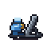 | **Howler** IM-8 | Mortar team | **3** foot | **45** r2–3 | — | **10** | Moves or fires, not both | A two-man mortar: indirect fire at 2–3 hexes from ground no gun carriage can reach. |
| 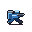 | **Gecko** IL-3 | Mountain raiders | **5** foot | **40** r1 | **10** r1 | **10** | Moves after attacking | Fast light infantry that strikes and steps back: the buggy’s hit-and-run rule on foot. |
|  | **Wombat** AP-6 | Armored carrier | **6** tracks | **20** r1 | **10** r1 | **50** | Carries 1: foot teams (Charlie, Kilroy, Meerkat, Howler, Gecko) | A tracked troop carrier with armor, so foot teams arrive at strength. |
|  | **Stork** HT-2 | Assault helicopter | **8** air | **30** r1 | **10** r1 | **30** | Carries 1: foot teams (Charlie, Kilroy, Meerkat, Howler, Gecko) | An armed, armored troop helicopter: airlift for foot teams with a door gun and defense 30. |
|  | **Camel** HX-8 | Heavy transporter | **8** wheels | — | — | **20** | Carries 1: Giant, Polar, Grizzly, Hadrian, Octopus, Atlas, Trigger, Snapper | A road tractor with a low trailer: heavy tracked units and emplacements at road speed. |
|  | **Wasp** AH-4 | Attack helicopter | **7** air | **55** r1 | **20** r1 | **25** | Moves after attacking | A gunship that strikes and pulls back: the buggy’s retreat rule in the air. |
|  | **Vulture** XM-3 | Stand-off drone | **9** air | **45** r2–3 | — | **25** | — | A loitering missile carrier: ground attack at 2–3 hexes from the air, over any screen. |
|  | **Shrike** XF-6 | Missile interceptor | **10** air | — | **60** r2–3 | **20** | — | An interceptor with air-to-air missiles at 2–3 hexes: kills bombers without taking their return fire. |
|  | **Mantis** SM-5 | Mobile SAM | **5** tracks | — | **60** r2–3 | **30** | — | Surface-to-air missiles that fire on the move: 2–3 hex air defense that keeps pace with the tanks. |
|  | **Snapper** PB-1 | Pillbox | **0** fixed | **60** r1 | **30** r1 | **60** | Stationary: set down by a carrier or factory | A concrete gun emplacement that counter-punches at 60: it holds a road junction or a factory approach. |
|  | **Pike** TD-8 | Tank destroyer | **5** tracks | **80** r1 | — | **50** | Moves or fires, not both | A turretless ambush gun: the heaviest direct fire in the set, but only from where it already stands. |
|  | **Hound** AC-2 | Armored car | **10** wheels | **40** r1 | **20** r1 | **30** | — | A six-wheeled armored car: ten road hexes per turn to screen flanks and catch soft targets. |
|  | **Squid** RT-7 | Rocket truck | **7** wheels | **55** r2–4 | — | **15** | Moves or fires, not both | Rocket artillery on a truck: a 2–4 hex salvo that relocates along roads at 7 hexes a turn. |

Ground and air columns give attack per strength point and firing band; a band starting at 2 cannot hit an adjacent unit. Move is movement points on the unit’s chassis. Every unit plays in both factions:

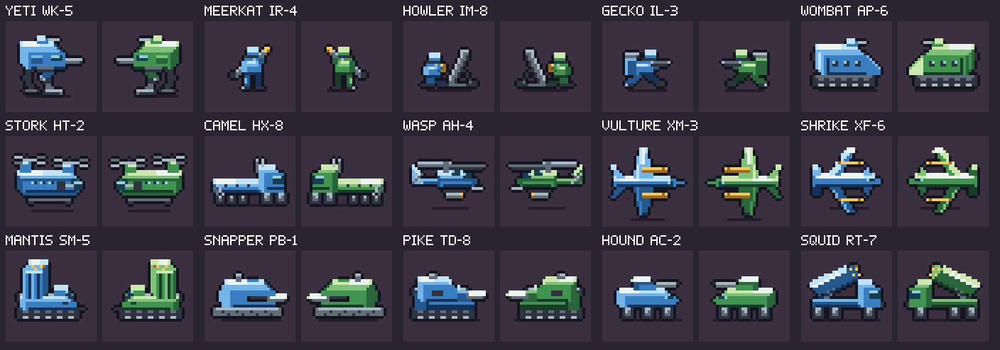

Native size (Union right, Xenon left, attack, spent): 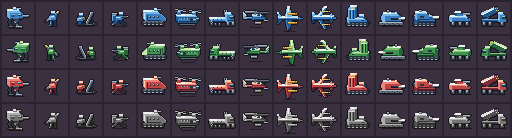

## Why these fifteen

### Review of the earlier study

- **What the earlier study did.** `tools/design-space` samples 240,000 ground-unit configurations, scores them in a weighted feature space (firepower 25%, armor 15%, firing bands 20%, terrain access 20%, rules 20%) and repeatedly picks the configuration farthest from every existing unit. Names, roles and fiction were assigned after the numbers were chosen. It is reproducible, states its own limits, screens for dominance and draws its sprites with the stock pipeline; this set keeps those four practices.
- **Distance is not usefulness.** Distance from existing units measures novelty, not whether a map has a use for the unit; its README says the procedure “tends to select unusual boundary cases”. Seven of its fifteen designs have move 0 or 1, against two of the 23 stock units (Atlas and Trigger). Badger has wheels and move 1 and plains cost wheels 2, so it moves only along roads, bridges and buildings; the README lists it as mostly road-bound and says Midge may not justify a scenario slot.
- **A linear budget misprices defense.** Its power screen counts defense linearly (def/80). Damage per point of attack is (100 − defense − terrain)%, with defense capped at 100, so on plains raising defense from 20 to 40 cuts damage taken by about a quarter while raising it from 60 to 80 cuts it by more than half. Tortoise and Rampart (defense 80, tracks) reach the cap on wasteland, where an attack that does not surround them does no damage. The README notes that the 80-defense designs can reach the cap; the budget prices them as if they could not.
- **Weights and scope.** The block weights are declared, not derived from play, and the README’s sensitivity check shows the first pick changes when the rule block is emphasized. The search covered ground units only and selected no carrier, and none of the fifteen is in the Mule’s whitelist, so only a Pelican can lift them. The README states that map usage, unit synergy and combat outcomes were not modeled; this set measures map usage (census) and outcomes (exchange tables), and brings carriers for its own foot teams.
- **Readability.** Marten combines three rules no stock unit combines: a wheeled capturer that moves after attacking and carries anti-air 85 at exactly two hexes. A player cannot read that from the map. Nine of the fifteen sprites share the same diagonal striped launcher rail, and Tortoise and Rampart are both long boxes on tracks.

### Method

1. **Start from the maps.** Count the terrain every bundled map set uses and where aircraft, carriers, heavy tanks and artillery appear (census below).
2. **List the empty cells.** Lay the stock roster out by chassis (foot, wheels, tracks, air, emplacement), firing band (direct, indirect), turn rule (normal, move-or-fire, retreat after attack) and carrier role. Keep the empty cells that matter on those maps.
3. **One decision per unit.** Each unit gets one sentence of identity and at most one special rule, so its role reads from the icon and the stat line.
4. **Existing rules only.** Only fields the engine already reads. The set loads now through a level’s `customUnits` block or the editor.
5. **Tune by exchanges.** Numbers are set by fights computed with `js/combat.js`: each unit must win the fight it exists for and lose to a named counter. build.js recomputes every printed trade and refuses to write the pages if a claim or gap test fails; verify.js asserts them again with the engine rules.
6. **Screen for dominance.** No unit may be at least as good as another unit of the same chassis and firing bands in every number and rule.
7. **Distinct names and silhouettes.** Animal names in the stock manner (Bison, Lynx, Pelican), plus the Yeti for the mountain walker; none is used by the stock roster, the official sequels, the earlier study or the parallel packs. Each sprite has its own signature shape.

### Map census

Computed from every bundled map by analyze.js. Combat aircraft (Eagle, Falcon, Hunter) appear in 30 of 119 maps; none of the AI-made or Environment campaigns maps field them, so the air and anti-air designs matter only where a map adds aircraft.

| Map set | Maps | Plains % | Roads % | Hills % | Wasteland % | Mountains % | Valleys % | Closed to tracks % | Closed to wheels % | Maps with combat aircraft | Maps with Pelican | Maps with Mule | Maps with heavy tanks | Maps with artillery |
|---|---:|---:|---:|---:|---:|---:|---:|---:|---:|---:|---:|---:|---:|---:|
| Campaign (normal) | 16 | 36.5 | 11 | 9.3 | 13.2 | 26.6 | 1.8 | 28.4 | 41.6 | 12 | 7 | 10 | 13 | 12 |
| Campaign (advanced) | 16 | 36.5 | 11 | 9.3 | 13.2 | 26.6 | 1.8 | 28.4 | 41.6 | 9 | 13 | 13 | 14 | 16 |
| Base Nectaris | 12 | 58.9 | 7.9 | 16.4 | 4.5 | 9.1 | 1.6 | 10.7 | 15.2 | 4 | 0 | 1 | 11 | 12 |
| Lunar Frontiers | 12 | 70.1 | 9.4 | 4.6 | 4.9 | 4.1 | 4.2 | 8.2 | 13.1 | 5 | 3 | 3 | 5 | 8 |
| AI-made | 15 | 17.1 | 15.2 | 8.2 | 2.8 | 55 | 0.2 | 55.2 | 58 | 0 | 11 | 15 | 15 | 15 |
| Environment campaigns | 48 | 60.6 | 9.3 | 10.2 | 6.9 | 11.5 | 0.5 | 12.1 | 18.9 | 0 | 12 | 20 | 36 | 37 |

## The units

Exchange tables show one full-strength attack (8 strength points each) at the shortest legal distance, with the engine’s expected strength points removed from the defender (kills) and from the attacker (loses). Reach is the farthest hex one move reaches across uniform terrain; — means the chassis cannot enter it.

### Foot units for ground that tracks cannot enter

Mountains and valleys are closed to tracks and wheels and make up 8% to 55% of the hexes in each bundled map set (census below). Of the stock ground units, only Charlie and Kilroy can enter them.

#### Yeti WK-5 — Armored walker

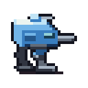 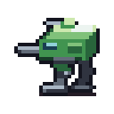

*A light tank on two legs: tank-grade gun and armor on foot, so it can climb where no tracked unit follows.*

| Move | Ground attack | Air attack | Defense | Special rule | Engine `cls` / placeholder `sprite` |
|---:|---:|---:|---:|---|---|
| 4 foot | 55, range 1 | 20, range 1 | 35 | — | `tank` / `KILROY` |

**Gap.** Tracks and wheels cannot enter mountains, so mountain fights are left to Charlie and Kilroy (defense 4 and 10). Nothing armored can hold a peak.

**Stock check** (all 23 stock units pass): No stock foot unit has ground attack of 50 or more, or defense of 20 or more.

**Reach per move:** road 4 · plains 4 · hills 4 · wasteland 2 · mountains 2

**How to use.** Walk it onto the ridge above a tank lane. On a mountain it adds 40 terrain defense and a Bison attacking it loses more than it kills. It moves 4 on open ground but only 2 hexes through mountains, so send it early. It cannot capture.

**Counters.** The Giant still wins the exchange. Artillery and the Howler hit it without a counter, and its air attack (20) does little against bombers.

| Exchange | Terrain | Kills | Loses | Counter | Shows |
|---|---|---:|---:|:---:|---|
| Bison attacks Yeti | Yeti on mountains | 1.0 | 2.5 | yes | A Bison cannot dislodge it from a mountain. |
| Bison attacks Kilroy | Kilroy on mountains | 2.2 | 1.9 | yes | The best stock mountain defender loses the same fight. |
| Giant attacks Yeti | Yeti on mountains | 1.9 | 0.8 | yes | The Giant remains its answer. |
| Yeti attacks Kilroy | Kilroy on mountains, Yeti on mountains | 2.3 | 0.9 | yes | It wins mountain infantry fights. |

**CPU.** Standard attack and advance planning. **Art.** Box body with a slit visor on two reverse-knee legs, short chest cannon, small roof gun.

#### Meerkat IR-4 — Anti-air team

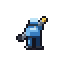 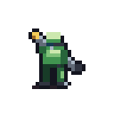

*Shoulder-launched missiles on foot: the first anti-air that can stand on a mountain.*

| Move | Ground attack | Air attack | Defense | Special rule | Engine `cls` / placeholder `sprite` |
|---:|---:|---:|---:|---|---|
| 3 foot | 10, range 1 | 60, range 1 | 10 | — | `antiair` / `CHARLIE` |

**Gap.** The Seeker and the Hawkeye run on tracks, so infantry in the mountains has no air cover. The best stock foot anti-air attack is 10.

**Stock check** (all 23 stock units pass): No stock foot unit has air attack above 10.

**Reach per move:** road 3 · plains 3 · hills 3 · wasteland 1 · mountains 1

**How to use.** Stand it on a peak beside the units it covers. An Eagle that attacks it there loses more than it kills. Its ground attack is 10, so keep it behind the line.

**Counters.** Anything that shoots ground targets: tanks, artillery, the Howler, even a Gecko. A Hunter still wins the exchange.

| Exchange | Terrain | Kills | Loses | Counter | Shows |
|---|---|---:|---:|:---:|---|
| Eagle attacks Meerkat | Meerkat on mountains | 3.1 | 3.6 | yes | An Eagle loses the exchange. |
| Eagle attacks Charlie | Charlie on mountains | 3.3 | 0.6 | yes | Stock mountain infantry against the same Eagle. |
| Hunter attacks Meerkat | Meerkat on mountains | 3.1 | 2.5 | yes | The Hunter still wins. |
| Bison attacks Meerkat | plains | 3.6 | 0.3 | yes | Tanks crush it in the open. |

**CPU.** Standard attack and advance planning. **Art.** Upright gunner with a steel launcher tube shouldered steeply at the sky; only the seeker head is ordnance yellow.

#### Howler IM-8 — Mortar team

 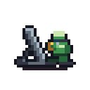

*A two-man mortar: indirect fire at 2–3 hexes from ground no gun carriage can reach.*

| Move | Ground attack | Air attack | Defense | Special rule | Engine `cls` / placeholder `sprite` |
|---:|---:|---:|---:|---|---|
| 3 foot | 45, range 2–3 | — | 10 | Moves or fires, not both | `artillery` / `KILROY` |

**Gap.** Every stock unit with indirect fire (Hadrian, Octopus, Atlas, Lynx, Hawkeye) runs on tracks or sits still, so there is no indirect fire inside mountain terrain.

**Stock check** (all 23 stock units pass): No stock foot unit has an indirect band (range above 1).

**Reach per move:** road 3 · plains 3 · hills 3 · wasteland 1 · mountains 1

**How to use.** Keep it one ridge behind the front and shell what the enemy parks on the far slope; indirect fire draws no counter. It moves or fires in a turn, never both, so set it up a turn ahead.

**Counters.** Anything that reaches it. Its band starts at 2, so an adjacent attacker takes no return fire, and it has no air attack.

| Exchange | Terrain | Kills | Loses | Counter | Shows |
|---|---|---:|---:|:---:|---|
| Howler attacks Kilroy | Kilroy on mountains, Howler on mountains | 1.9 | 0.0 | no | Shells mountain infantry with no return fire. |
| Howler attacks Yeti | Yeti on mountains, Howler on mountains | 1.0 | 0.0 | no | Also the answer to an entrenched Yeti. |
| Kilroy attacks Howler | plains | 2.9 | 0.0 | no | Defenseless when reached. |

**CPU.** Handled as a ranged move-or-fire unit: it activates early, shoots only from where it stands, and its advance prefers hexes outside enemy zones of control. **Art.** Kneeling loader holding a shell beside a thick steel tube on a baseplate with a short bipod.

#### Gecko IL-3 — Mountain raiders

 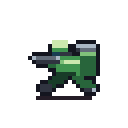

*Fast light infantry that strikes and steps back: the buggy’s hit-and-run rule on foot.*

| Move | Ground attack | Air attack | Defense | Special rule | Engine `cls` / placeholder `sprite` |
|---:|---:|---:|---:|---|---|
| 5 foot | 40, range 1 | 10, range 1 | 10 | Moves after attacking | `infantry` / `CHARLIE` |

**Gap.** Only the Rabbit and the Lynx may move after attacking, and both run on tracks. Nothing can raid through mountains and withdraw.

**Stock check** (all 23 stock units pass): No stock foot unit may move after attacking.

**Reach per move:** road 5 · plains 5 · hills 5 · wasteland 2 · mountains 2

**How to use.** Attack from a ridge, then spend the remaining movement to step back onto a mountain or out of reach. Artillery cannot answer an adjacent attacker, so Geckos hunt Hadrians and Octopi parked at the foot of a range. They cannot capture.

**Counters.** Tanks on open ground and any indirect fire; defense 10 does not survive a direct hit.

| Exchange | Terrain | Kills | Loses | Counter | Shows |
|---|---|---:|---:|:---:|---|
| Gecko attacks Hadrian | plains | 2.2 | 0.0 | no | Artillery cannot fire back at an adjacent raider. |
| Gecko attacks Charlie | plains | 3.1 | 0.8 | yes | Beats stock infantry. |
| Bison attacks Gecko | plains | 3.6 | 1.9 | yes | Loses to tanks in the open. |

**CPU.** After an attack the CPU spends the leftover movement on the reachable hex farthest from the nearest enemy, as for buggies. **Art.** Soldier in a forward lunge with a tall mountain rucksack and bedroll, carbine held low.

### Carriers

Both stock carriers have defense 10. A damaged carrier cuts its passengers to its own remaining strength, and cargo dies with its carrier (`js/engine.js`).

#### Wombat AP-6 — Armored carrier

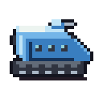 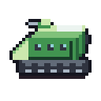

*A tracked troop carrier with armor, so foot teams arrive at strength.*

| Move | Ground attack | Air attack | Defense | Special rule | Engine `cls` / placeholder `sprite` |
|---:|---:|---:|---:|---|---|
| 6 tracks | 20, range 1 | 10, range 1 | 50 | Carries 1: foot teams (Charlie, Kilroy, Meerkat, Howler, Gecko) | `transport` / `MULE` |

**Gap.** Every shot at a Mule is a shot at its squad: damage to a carrier cuts its passengers to the carrier’s remaining strength. Both stock carriers have defense 10 and neither runs on tracks.

**Stock check** (all 23 stock units pass): No stock ground carrier has defense above 10 or runs on tracks.

**Reach per move:** road 6 · plains 6 · hills 3 · wasteland 2 · mountains —

**How to use.** Carry a Kilroy, Meerkat or Howler across open ground under fire and unload at the foot of the hills. Six moves on tracks keeps pace with a Bison. Its guns (20/10) finish damaged infantry; they are not for fighting.

**Counters.** Heavy tanks and artillery still stop it. It carries one team and loads or unloads once per turn.

| Exchange | Terrain | Kills | Loses | Counter | Shows |
|---|---|---:|---:|:---:|---|
| Bison attacks Mule | plains | 3.6 | 0.3 | yes | A Bison against a loaded Mule. |
| Bison attacks Wombat | plains | 1.9 | 1.0 | yes | The same Bison removes about half as much. |
| Kilroy attacks Wombat | plains | 1.6 | 1.5 | yes | A Kilroy attacking it trades about evenly. |

**CPU.** Plans transport first, like the Mule, and uses normal attack planning only when it has no transport task. **Art.** Tall troop box on tracks with a sloped glacis, three firing ports and a small gun cupola; no turret.

#### Stork HT-2 — Assault helicopter

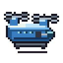 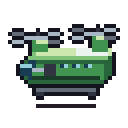

*An armed, armored troop helicopter: airlift for foot teams with a door gun and defense 30.*

| Move | Ground attack | Air attack | Defense | Special rule | Engine `cls` / placeholder `sprite` |
|---:|---:|---:|---:|---|---|
| 8 air | 30, range 1 | 10, range 1 | 30 | Carries 1: foot teams (Charlie, Kilroy, Meerkat, Howler, Gecko) | `transport` / `PELICAN` |

**Gap.** The Pelican is the only air carrier: unarmed, defense 10. An airlift into a defended landing zone loses the passenger with the carrier.

**Stock check** (all 23 stock units pass): No stock air carrier has any attack or defense above 10.

**Reach per move:** road 8 · plains 8 · hills 8 · wasteland 8 · mountains 8

**How to use.** Lift a Charlie or a Kilroy over a mountain range to a thinly held factory. It carries foot teams only; heavy loads stay with the Pelican or the Camel.

**Counters.** Anti-air of every kind and fighters; a Seeker still wins the exchange.

| Exchange | Terrain | Kills | Loses | Counter | Shows |
|---|---|---:|---:|:---:|---|
| Seeker attacks Pelican | plains | 4.8 | 0.0 | no | A Seeker against a loaded Pelican. |
| Seeker attacks Stork | plains | 3.9 | 1.7 | yes | The same Seeker kills less and takes return fire. |
| Kilroy attacks Stork | plains | 0.6 | 2.2 | yes | Infantry cannot contest its landing. |
| Stork attacks Charlie | plains | 2.3 | 0.6 | yes | The door gun clears a landing zone. |

**CPU.** Plans transport first. The CPU’s base-defense trigger does not recognize it (see AI notes). **Art.** Long fuselage with a window row and door gunner under two separate crossed rotors, the rear one higher.

#### Camel HX-8 — Heavy transporter

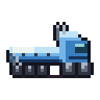 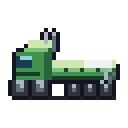

*A road tractor with a low trailer: heavy tracked units and emplacements at road speed.*

| Move | Ground attack | Air attack | Defense | Special rule | Engine `cls` / placeholder `sprite` |
|---:|---:|---:|---:|---|---|
| 8 wheels | — | — | 20 | Carries 1: Giant, Polar, Grizzly, Hadrian, Octopus, Atlas, Trigger, Snapper | `transport` / `MULE` |

**Gap.** The Giant moves 2 and the Polar and Grizzly 4, and no ground carrier accepts them. Only the Pelican can lift them: by air, at defense 10, in reach of every anti-air unit.

**Stock check** (all 23 stock units pass): No stock ground carrier accepts the Giant, Polar or Grizzly.

**Reach per move:** road 8 · plains 4 · hills 2 · wasteland — · mountains —

**How to use.** Run a Giant or a Hadrian 8 hexes down a road and unload it one hex short of the front. Anti-air units cannot touch it. It has no guns; escort it. Its cargo list is tracked units with move 4 or less plus the three emplacements.

**Counters.** Any ground attacker. Off the road it moves 4 on plains and cannot enter wasteland or mountains.

| Exchange | Terrain | Kills | Loses | Counter | Shows |
|---|---|---:|---:|:---:|---|
| Hawkeye attacks Pelican | plains | 6.0 | 0.0 | no | Today’s only heavy lift against a Hawkeye. |
| Hawkeye attacks Camel | plains | — | — | no attack | Anti-air cannot target it. |
| Bison attacks Camel | plains | 3.1 | 0.0 | no | Unarmed against tanks. |

**CPU.** Plans transport like any carrier; the CPU loads stationary cargo only from factories. **Art.** Long flat trailer with tie-down points and rear ramps behind a tall tractor cab with twin exhaust stacks; many small wheels.

### Air rules

Every stock combat aircraft fights at range 1, never moves after attacking, and takes a counter from any direct-fire anti-air it attacks.

#### Wasp AH-4 — Attack helicopter

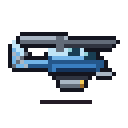 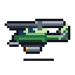

*A gunship that strikes and pulls back: the buggy’s retreat rule in the air.*

| Move | Ground attack | Air attack | Defense | Special rule | Engine `cls` / placeholder `sprite` |
|---:|---:|---:|---:|---|---|
| 7 air | 55, range 1 | 20, range 1 | 25 | Moves after attacking | `air` / `EAGLE` |

**Gap.** No stock aircraft may move after attacking, so every air strike ends parked next to its target, inside the enemy’s anti-air.

**Stock check** (all 23 stock units pass): No stock air unit may move after attacking.

**Reach per move:** road 7 · plains 7 · hills 7 · wasteland 7 · mountains 7

**How to use.** Hit tanks and artillery, which cannot fire at aircraft (the Giant is the exception), then fly back behind your own Seekers. It moves 7, so start close.

**Counters.** Seekers and Meerkats at range 1, the Hawkeye and Mantis at range, fighters. Attacking a Seeker loses.

| Exchange | Terrain | Kills | Loses | Counter | Shows |
|---|---|---:|---:|:---:|---|
| Wasp attacks Bison | plains | 2.5 | 0.0 | no | Tanks cannot answer it. |
| Wasp attacks Hadrian | plains | 3.1 | 0.0 | no | Nor can artillery. |
| Wasp attacks Seeker | plains | 3.1 | 4.0 | yes | Attacking anti-air loses. |
| Seeker attacks Wasp | plains | 4.0 | 3.1 | yes | Anti-air wins on its own turn. |

**CPU.** Retreats after attacking like a buggy. **Art.** Slim two-seat gunship with a stepped canopy, one long rotor, chin gun and a stub-wing rocket pod.

#### Vulture XM-3 — Stand-off drone

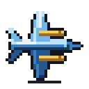 

*A loitering missile carrier: ground attack at 2–3 hexes from the air, over any screen.*

| Move | Ground attack | Air attack | Defense | Special rule | Engine `cls` / placeholder `sprite` |
|---:|---:|---:|---:|---|---|
| 9 air | 45, range 2–3 | — | 25 | — | `air` / `HUNTER` |

**Gap.** Every stock aircraft attacks at range 1. A ring of units around a target keeps bombers out, and every air attack on anti-air draws a counter.

**Stock check** (all 23 stock units pass): No stock air unit has an indirect ground band.

**Reach per move:** road 9 · plains 9 · hills 9 · wasteland 9 · mountains 9

**How to use.** Fly in and fire over the enemy line at the artillery or anti-air behind it; nothing counters indirect fire. It may move and fire in one turn.

**Counters.** Fighters (it has no air attack), the Hawkeye and Shrike at range, and any anti-air it ends next to.

| Exchange | Terrain | Kills | Loses | Counter | Shows |
|---|---|---:|---:|:---:|---|
| Vulture attacks Seeker | plains | 2.5 | 0.0 | no | Strikes anti-air without a counter. |
| Vulture attacks Hawkeye | plains | 2.5 | 0.0 | no | Including the Hawkeye. |
| Falcon attacks Vulture | plains | 5.4 | 0.0 | no | Fighters kill it. |

**CPU.** Standard planning; the planner scores attacks from every hex in range. **Art.** Planform drone with a very long straight wing, slim body, V-tail and two heavy missiles on inboard pylons.

#### Shrike XF-6 — Missile interceptor

 

*An interceptor with air-to-air missiles at 2–3 hexes: kills bombers without taking their return fire.*

| Move | Ground attack | Air attack | Defense | Special rule | Engine `cls` / placeholder `sprite` |
|---:|---:|---:|---:|---|---|
| 10 air | — | 60, range 2–3 | 20 | — | `air` / `FALCON` |

**Gap.** The Falcon is the only dedicated fighter and fights at range 1, where a Hunter (air attack 70) shoots back and wins.

**Stock check** (all 23 stock units pass): No stock air unit has an indirect air band.

**Reach per move:** road 10 · plains 10 · hills 10 · wasteland 10 · mountains 10

**How to use.** Pick off Hunters and Eagles from two hexes. A Falcon that reaches it wins easily, so keep ground units between them.

**Counters.** Falcons and every direct-fire anti-air unit: it cannot shoot back at range 1. No ground attack.

| Exchange | Terrain | Kills | Loses | Counter | Shows |
|---|---|---:|---:|:---:|---|
| Falcon attacks Hunter | plains | 3.9 | 4.1 | yes | The stock fighter loses to a Hunter. |
| Shrike attacks Hunter | plains | 2.5 | 0.0 | no | The Shrike takes nothing back. |
| Falcon attacks Shrike | plains | 5.7 | 0.0 | no | A Falcon that reaches it wins. |

**CPU.** Standard planning. **Art.** Forward-swept wings, canards and twin fins; missiles on the wing rails.

### Ground rule combinations

Rule combinations the stock ground roster never uses: indirect anti-air that moves and fires, direct fire that must stand still, a fixed gun, and armed wheeled vehicles.

#### Mantis SM-5 — Mobile SAM

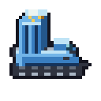 

*Surface-to-air missiles that fire on the move: 2–3 hex air defense that keeps pace with the tanks.*

| Move | Ground attack | Air attack | Defense | Special rule | Engine `cls` / placeholder `sprite` |
|---:|---:|---:|---:|---|---|
| 5 tracks | — | 60, range 2–3 | 30 | — | `antiair` / `HAWKEYE` |

**Gap.** The Hawkeye’s 2–5 air band is move-or-fire, so it cannot advance and shoot in one turn; the Seeker fights only adjacent.

**Stock check** (all 23 stock units pass): No stock unit has an indirect air band without move-or-fire.

**Reach per move:** road 5 · plains 5 · hills 2 · wasteland 1 · mountains —

**How to use.** Advance one hex behind the tank line. Aircraft that come to strike the tanks are in its 2–3 band, and it may move and fire in the same turn; an aircraft that gets adjacent to it is unanswered.

**Counters.** Anything on the ground: with no ground attack it never counters a ground attacker. It cannot hit an adjacent aircraft either.

| Exchange | Terrain | Kills | Loses | Counter | Shows |
|---|---|---:|---:|:---:|---|
| Eagle attacks Seeker | plains | 3.9 | 3.9 | yes | Stock anti-air trades evenly with an Eagle. |
| Mantis attacks Eagle | plains | 3.6 | 0.0 | no | The Mantis fires first and takes nothing back. |
| Eagle attacks Mantis | plains | 3.9 | 0.0 | no | An Eagle that reaches it is unanswered. |
| Bison attacks Mantis | plains | 2.8 | 0.0 | no | Defenseless against ground attack. |

**CPU.** Handled as a ranged unit that may move and fire. **Art.** Tracked chassis with a tall vertical-launch canister block at the rear, missile caps on the lid, small driver cab.

#### Snapper PB-1 — Pillbox

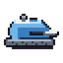 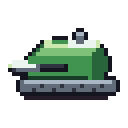

*A concrete gun emplacement that counter-punches at 60: it holds a road junction or a factory approach.*

| Move | Ground attack | Air attack | Defense | Special rule | Engine `cls` / placeholder `sprite` |
|---:|---:|---:|---:|---|---|
| 0 fixed | 60, range 1 | 30, range 1 | 60 | Stationary: set down by a carrier or factory | `tank` / `TRIGGER` |

**Gap.** The two stock emplacements are the Atlas (indirect fire, defense 20) and the Trigger (no weapon). Nothing fixed shoots back at an attacker.

**Stock check** (all 23 stock units pass): No stock stationary unit has a direct-fire band.

**Reach per move:** road 0 · plains 0 · hills 0 · wasteland 0 · mountains 0

**How to use.** Carry it with a Camel or Pelican, or deploy it from a factory, and drop it where the enemy must pass. It can only be set down on plains, roads, bridges or an owned factory, and it never moves again.

**Counters.** Artillery and the Vulture hit it without a counter; the Giant wins the exchange; any unit can go around it.

| Exchange | Terrain | Kills | Loses | Counter | Shows |
|---|---|---:|---:|:---:|---|
| Bison attacks Snapper | plains | 1.5 | 2.8 | yes | A medium tank loses the attack. |
| Grizzly attacks Snapper | plains | 2.1 | 2.3 | yes | So does a Grizzly. |
| Giant attacks Snapper | plains | 2.5 | 0.8 | yes | The Giant cracks it. |
| Hadrian attacks Snapper | plains | 1.4 | 0.0 | no | Artillery is the safe answer. |

**CPU.** Deployed at the first open factory exit and never moved (see AI notes). **Art.** Low faceted concrete slab with a dark firing slit and barrel, a periscope on the roof and a sandbag berm around its foot.

#### Pike TD-8 — Tank destroyer

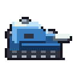 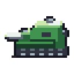

*A turretless ambush gun: the heaviest direct fire in the set, but only from where it already stands.*

| Move | Ground attack | Air attack | Defense | Special rule | Engine `cls` / placeholder `sprite` |
|---:|---:|---:|---:|---|---|
| 5 tracks | 80, range 1 | — | 50 | Moves or fires, not both | `tank` / `POLAR` |

**Gap.** Every stock direct-fire unit may move and fire; move-or-fire exists only on indirect guns and the Hawkeye. No ambusher trades mobility for a heavier gun.

**Stock check** (all 23 stock units pass): No stock unit combines a direct-fire band with move-or-fire.

**Reach per move:** road 5 · plains 5 · hills 2 · wasteland 1 · mountains —

**How to use.** Park it at a choke point before the enemy arrives. A tank that attacks it takes an 80-attack counter; one that stops next to it is shot on the next turn.

**Counters.** Artillery and aircraft (it has no air attack). Flank it: it cannot move and attack in the same turn. The Giant still wins.

| Exchange | Terrain | Kills | Loses | Counter | Shows |
|---|---|---:|---:|:---:|---|
| Grizzly attacks Pike | plains | 2.5 | 3.1 | yes | A Grizzly attacking it loses. |
| Titan attacks Pike | plains | 2.3 | 3.1 | yes | So does a Titan. |
| Giant attacks Pike | plains | 3.4 | 1.0 | yes | The Giant wins. |
| Hadrian attacks Pike | plains | 1.7 | 0.0 | no | Artillery is the safe answer. |

**CPU.** Handled as a move-or-fire unit: it activates early, fires only at targets already adjacent, and its advance prefers hexes outside enemy zones of control. **Art.** Low hull on long tracks with a fixed casemate, sloped front plate, box mantlet and the longest barrel in the set.

#### Hound AC-2 — Armored car

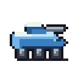 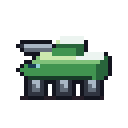

*A six-wheeled armored car: ten road hexes per turn to screen flanks and catch soft targets.*

| Move | Ground attack | Air attack | Defense | Special rule | Engine `cls` / placeholder `sprite` |
|---:|---:|---:|---:|---|---|
| 10 wheels | 40, range 1 | 20, range 1 | 30 | — | `buggy` / `RABBIT` |

**Gap.** The stock wheeled units are the Panther (infantry, defense 8) and the Mule (carrier). No armed wheeled vehicle uses the road network.

**Stock check** (all 23 stock units pass): No stock wheeled unit has ground attack above 10.

**Reach per move:** road 10 · plains 5 · hills 2 · wasteland — · mountains —

**How to use.** Race down roads to catch artillery, infantry and carriers, or close a gap in the line with its zone of control. Off the road it slows to 5 hexes on plains and 2 on hills.

**Counters.** Any tank; the Rabbit wins the trade.

| Exchange | Terrain | Kills | Loses | Counter | Shows |
|---|---|---:|---:|:---:|---|
| Hound attacks Charlie | plains | 3.1 | 0.5 | yes | Catches infantry. |
| Hound attacks Hadrian | plains | 2.2 | 0.0 | no | Catches artillery. |
| Rabbit attacks Hound | plains | 3.9 | 2.5 | yes | Loses to the Rabbit. |
| Bison attacks Hound | plains | 2.8 | 1.9 | yes | Loses to tanks. |

**CPU.** Standard attack and advance planning. **Art.** Boat-shaped hull on three exposed axles with a small flat turret and short autocannon.

#### Squid RT-7 — Rocket truck

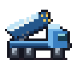 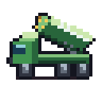

*Rocket artillery on a truck: a 2–4 hex salvo that relocates along roads at 7 hexes a turn.*

| Move | Ground attack | Air attack | Defense | Special rule | Engine `cls` / placeholder `sprite` |
|---:|---:|---:|---:|---|---|
| 7 wheels | 55, range 2–4 | — | 15 | Moves or fires, not both | `artillery` / `OCTOPUS` |

**Gap.** The stock guns that reach 3 hexes or more (Hadrian, Octopus, Atlas) run on tracks at move 4 or sit still; the Lynx moves 6 but reaches only 2. No artillery can shift across a road network between salvos.

**Stock check** (all 23 stock units pass): No stock wheeled unit has an indirect band, and no stock unit whose ground band reaches 3 or more moves more than 4.

**Reach per move:** road 7 · plains 3 · hills 1 · wasteland — · mountains —

**How to use.** Fire one turn, drive to the next road junction the following turn. It fires or moves, never both.

**Counters.** Anything that reaches it: defense 15, and its band starts at 2. The Octopus outguns it in a counter-battery duel.

| Exchange | Terrain | Kills | Loses | Counter | Shows |
|---|---|---:|---:|:---:|---|
| Squid attacks Hadrian | plains | 3.1 | 0.0 | no | Salvo against artillery. |
| Squid attacks Bison | plains | 2.5 | 0.0 | no | Salvo against tanks. |
| Hound attacks Squid | plains | 2.8 | 0.0 | no | Defenseless when reached. |
| Octopus attacks Squid | plains | 4.0 | 0.0 | no | An Octopus salvo on it. |
| Squid attacks Octopus | plains | 3.1 | 0.0 | no | Its salvo on an Octopus removes less: it loses a counter-battery duel. |

**CPU.** Handled as a ranged move-or-fire unit, like the Hadrian. **Art.** Truck with a raised, angled rocket pack whose front face shows yellow tube mouths.

## Engine and AI notes

- In-game art is a placeholder. The pack’s sprites are review art; the renderer draws each unit with the stock sprite named in its `sprite` field (`spriteIdFor` in `js/render.js`), which shows the chassis a player must read: foot, vehicle, aircraft or emplacement. `cls` picks the classic and neon vector shape and the combat panel label, for example “tank · foot” for the Yeti.
- Emplacements can only be unloaded or deployed onto plains, roads, bridges and owned factories (terrain flag `deployable`), so a Snapper in play stands at defense 65 at most. Level authors should not pre-place it on wasteland (defense 90) or hills.
- Base defense only watches Pelicans. `threatenedBase` in `js/ai.js` reacts to an enemy `PELICAN` carrying a capturer; a Stork, Wombat or Mule airlift or drive toward a base does not trigger it. If Stork enters play, that test should look for any loaded carrier within reach instead of the Pelican ID.
- Stationary units deploy at the first open factory exit. `deployOneFactory` has a firing-band rule only for the Atlas; a Snapper, like the stock Trigger, can be deployed where it permanently blocks one of its own factory’s six exits.
- Carrier planning is general. `planTransport` and `boardOnePassenger` accept any passenger that `canLoad` allows, capturers first, so Wombat, Stork and Camel need no AI code. The CPU boards stationary cargo (Atlas, Trigger, Snapper) only from factories.
- Mule and Pelican whitelists are unchanged. The Mule does not accept Meerkat, Howler or Gecko; the Pelican (no whitelist) accepts every non-air ground unit, including Snapper.
- Apex turn time grows with unit count. On a 42-unit test map one apex turn took 143 s with this set and 126 s with stock units of the same chassis in their places; on the largest stock maps (25 and 26 units) it took 13 to 29 s. Measured once on 2026-09-23 on the development machine, not recomputed by build.js. Keep maps that use this set near stock unit counts.

## Loading the set

1. Open `editor.html`, paste the contents of [custom-units.json](custom-units.json) into **Custom unit types (JSON)** and press **Apply custom units**. The editor stores them and writes them into the `customUnits` block of each level it saves.
2. Or add the same object as `customUnits` in a level JSON file; `startGame` in `js/main.js` merges it before the game is built.

Mixed maps need a carrier that accepts the new foot teams: Wombat or Stork (the Mule’s whitelist is unchanged).

## Reproduce

```sh
node opus55/build.js    # icons, sheets, custom-units.json, analysis.json, index.html, README.md
node opus55/verify.js   # sprite contract, gap tests, exchanges, engine rules, CPU smoke games, generated files
```

## Files

| File | Contents |
|---|---|
| `units.js` | Source of truth: prose, engine definitions, gap tests and exchange claims. |
| `icons.js` | Original 32×32 indexed sprites in the stock palette, projection, light and outline rules. |
| `analyze.js` | Engine-backed measurements: exchanges, reach, map census, dominance screen. |
| `build.js` | Writes every generated file listed here. |
| `verify.js` | Asserts every claim in this README against the engine and the files on disk. |
| `custom-units.json` | The engine definitions, keyed by unit ID, ready for customUnits. |
| `analysis.json` | All computed numbers: census, reach, exchanges, gap tests, sprite bounds. |
| `index.html` | Self-contained visual overview with embedded icons. |
| `icons/` | Per unit: Union and Xenon in both facings, attack and spent states at native size, plus 2x and 4x copies. |
| `sheet.png, sheet-x4.png` | Contact sheets at native size and 4x. |
